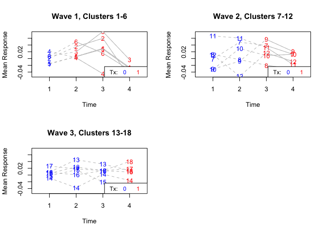

# Load packages

```r
library(tidyverse)
library(readxl)
library(writexl)
library(here)
library(kableExtra)
library(ggplot2)
library(readr)
library(jtools) # for summ() and plot_summs
library(sjPlot) # for tab_model

library(lmerTest) # GLMM for CRTs with cont outcome: cluster-specific model (conditional)
library(geepack) # GEE for CRTs: population-averaged model (marginal) incl. sandwich esimtaor and exchangeable correlation structure
library(ICC) # one-way ANOVA (analysis of variance) using mean squares within and between clusters
library(swCRTdesign) # stepped-wedge design plot
```

# Load data


# Parallel CRT

```r
### continous outcome (here it's not the target trial outcome, it's an intermediate outcome)
## ambroise trial, standard two group CRT, cohort sampling (the same people recruited and assessed, but only assessed once, at the end)
# reformat
df$GROUP <- as.factor(df$GROUP)
df$CENTER <- as.factor(df$CENTER)

# GLMM 
calintake.glmm <- lmer(CALBEFORE ~ (1|CENTER) + GROUP,
                   data = df)
tab_model(calintake.glmm)
```

<table style="border-collapse:collapse; border:none;">
<tr>
<th style="border-top: double; text-align:center; font-style:normal; font-weight:bold; padding:0.2cm;  text-align:left; ">&nbsp;</th>
<th colspan="3" style="border-top: double; text-align:center; font-style:normal; font-weight:bold; padding:0.2cm; ">CALBEFORE</th>
</tr>
<tr>
<td style=" text-align:center; border-bottom:1px solid; font-style:italic; font-weight:normal;  text-align:left; ">Predictors</td>
<td style=" text-align:center; border-bottom:1px solid; font-style:italic; font-weight:normal;  ">Estimates</td>
<td style=" text-align:center; border-bottom:1px solid; font-style:italic; font-weight:normal;  ">CI</td>
<td style=" text-align:center; border-bottom:1px solid; font-style:italic; font-weight:normal;  ">p</td>
</tr>
<tr>
<td style=" padding:0.2cm; text-align:left; vertical-align:top; text-align:left; ">(Intercept)</td>
<td style=" padding:0.2cm; text-align:left; vertical-align:top; text-align:center;  ">1771.65</td>
<td style=" padding:0.2cm; text-align:left; vertical-align:top; text-align:center;  ">1666.16&nbsp;&ndash;&nbsp;1877.14</td>
<td style=" padding:0.2cm; text-align:left; vertical-align:top; text-align:center;  "><strong>&lt;0.001</strong></td>
</tr>
<tr>
<td style=" padding:0.2cm; text-align:left; vertical-align:top; text-align:left; ">GROUP2 × Fasting</td>
<td style=" padding:0.2cm; text-align:left; vertical-align:top; text-align:center;  ">&#45;284.03</td>
<td style=" padding:0.2cm; text-align:left; vertical-align:top; text-align:center;  ">&#45;436.01&nbsp;&ndash;&nbsp;-132.06</td>
<td style=" padding:0.2cm; text-align:left; vertical-align:top; text-align:center;  "><strong>&lt;0.001</strong></td>
</tr>
<tr>
<td colspan="4" style="font-weight:bold; text-align:left; padding-top:.8em;">Random Effects</td>
</tr>

<tr>
<td style=" padding:0.2cm; text-align:left; vertical-align:top; text-align:left; padding-top:0.1cm; padding-bottom:0.1cm;">&sigma;<sup>2</sup></td>
<td style=" padding:0.2cm; text-align:left; vertical-align:top; padding-top:0.1cm; padding-bottom:0.1cm; text-align:left;" colspan="3">341560.36</td>
</tr>

<tr>
<td style=" padding:0.2cm; text-align:left; vertical-align:top; text-align:left; padding-top:0.1cm; padding-bottom:0.1cm;">&tau;<sub>00</sub> <sub>CENTER</sub></td>
<td style=" padding:0.2cm; text-align:left; vertical-align:top; padding-top:0.1cm; padding-bottom:0.1cm; text-align:left;" colspan="3">25255.34</td>

<tr>
<td style=" padding:0.2cm; text-align:left; vertical-align:top; text-align:left; padding-top:0.1cm; padding-bottom:0.1cm;">ICC</td>
<td style=" padding:0.2cm; text-align:left; vertical-align:top; padding-top:0.1cm; padding-bottom:0.1cm; text-align:left;" colspan="3">0.07</td>

<tr>
<td style=" padding:0.2cm; text-align:left; vertical-align:top; text-align:left; padding-top:0.1cm; padding-bottom:0.1cm;">N <sub>CENTER</sub></td>
<td style=" padding:0.2cm; text-align:left; vertical-align:top; padding-top:0.1cm; padding-bottom:0.1cm; text-align:left;" colspan="3">22</td>
<tr>
<td style=" padding:0.2cm; text-align:left; vertical-align:top; text-align:left; padding-top:0.1cm; padding-bottom:0.1cm; border-top:1px solid;">Observations</td>
<td style=" padding:0.2cm; text-align:left; vertical-align:top; padding-top:0.1cm; padding-bottom:0.1cm; text-align:left; border-top:1px solid;" colspan="3">1130</td>
</tr>
<tr>
<td style=" padding:0.2cm; text-align:left; vertical-align:top; text-align:left; padding-top:0.1cm; padding-bottom:0.1cm;">Marginal R<sup>2</sup> / Conditional R<sup>2</sup></td>
<td style=" padding:0.2cm; text-align:left; vertical-align:top; padding-top:0.1cm; padding-bottom:0.1cm; text-align:left;" colspan="3">0.052 / 0.117</td>
</tr>

</table>

```r
summ(calintake.glmm, exp = T, confint = T, model.info = T, model.fit = T, digits = 2)
```

<table class="table table-striped table-hover table-condensed table-responsive" style="width: auto !important; margin-left: auto; margin-right: auto;">
<tbody>
  <tr>
   <td style="text-align:left;font-weight: bold;"> Observations </td>
   <td style="text-align:right;"> 1130 </td>
  </tr>
  <tr>
   <td style="text-align:left;font-weight: bold;"> Dependent variable </td>
   <td style="text-align:right;"> CALBEFORE </td>
  </tr>
  <tr>
   <td style="text-align:left;font-weight: bold;"> Type </td>
   <td style="text-align:right;"> Mixed effects linear regression </td>
  </tr>
</tbody>
</table> <table class="table table-striped table-hover table-condensed table-responsive" style="width: auto !important; margin-left: auto; margin-right: auto;">
<tbody>
  <tr>
   <td style="text-align:left;font-weight: bold;"> AIC </td>
   <td style="text-align:right;"> 17624.18 </td>
  </tr>
  <tr>
   <td style="text-align:left;font-weight: bold;"> BIC </td>
   <td style="text-align:right;"> 17644.30 </td>
  </tr>
  <tr>
   <td style="text-align:left;font-weight: bold;"> Pseudo-R² (fixed effects) </td>
   <td style="text-align:right;"> 0.05 </td>
  </tr>
  <tr>
   <td style="text-align:left;font-weight: bold;"> Pseudo-R² (total) </td>
   <td style="text-align:right;"> 0.12 </td>
  </tr>
</tbody>
</table> <table class="table table-striped table-hover table-condensed table-responsive" style="width: auto !important; margin-left: auto; margin-right: auto;border-bottom: 0;">
 <thead>
<tr><th style="border-bottom:hidden;padding-bottom:0; padding-left:3px;padding-right:3px;text-align: center; " colspan="7"><div style="border-bottom: 1px solid #ddd; padding-bottom: 5px; ">Fixed Effects</div></th></tr>
  <tr>
   <th style="text-align:left;">   </th>
   <th style="text-align:right;"> exp(Est.) </th>
   <th style="text-align:right;"> 2.5% </th>
   <th style="text-align:right;"> 97.5% </th>
   <th style="text-align:right;"> t val. </th>
   <th style="text-align:right;"> d.f. </th>
   <th style="text-align:right;"> p </th>
  </tr>
 </thead>
<tbody>
  <tr>
   <td style="text-align:left;font-weight: bold;"> (Intercept) </td>
   <td style="text-align:right;"> Inf </td>
   <td style="text-align:right;"> Inf </td>
   <td style="text-align:right;"> Inf </td>
   <td style="text-align:right;"> 32.95 </td>
   <td style="text-align:right;"> 19.54 </td>
   <td style="text-align:right;"> 0.00 </td>
  </tr>
  <tr>
   <td style="text-align:left;font-weight: bold;"> GROUP2: Fasting </td>
   <td style="text-align:right;"> 0.00 </td>
   <td style="text-align:right;"> 0.00 </td>
   <td style="text-align:right;"> 0.00 </td>
   <td style="text-align:right;"> -3.67 </td>
   <td style="text-align:right;"> 20.60 </td>
   <td style="text-align:right;"> 0.00 </td>
  </tr>
</tbody>
<tfoot><tr><td style="padding: 0; " colspan="100%">
<sup></sup>  p values calculated using Satterthwaite d.f. </td></tr></tfoot>
</table> <table class="table table-striped table-hover table-condensed table-responsive" style="width: auto !important; margin-left: auto; margin-right: auto;">
 <thead>
<tr><th style="border-bottom:hidden;padding-bottom:0; padding-left:3px;padding-right:3px;text-align: center; " colspan="3"><div style="border-bottom: 1px solid #ddd; padding-bottom: 5px; ">Random Effects</div></th></tr>
  <tr>
   <th> Group </th>
   <th> Parameter </th>
   <th> Std. Dev. </th>
  </tr>
 </thead>
<tbody>
  <tr>
   <td> CENTER </td>
   <td> (Intercept) </td>
   <td> 158.92 </td>
  </tr>
  <tr>
   <td> Residual </td>
   <td>  </td>
   <td> 584.43 </td>
  </tr>
</tbody>
</table> <table class="table table-striped table-hover table-condensed table-responsive" style="width: auto !important; margin-left: auto; margin-right: auto;">
 <thead>
<tr><th style="border-bottom:hidden;padding-bottom:0; padding-left:3px;padding-right:3px;text-align: center; " colspan="3"><div style="border-bottom: 1px solid #ddd; padding-bottom: 5px; ">Grouping Variables</div></th></tr>
  <tr>
   <th> Group </th>
   <th> # groups </th>
   <th> ICC </th>
  </tr>
 </thead>
<tbody>
  <tr>
   <td> CENTER </td>
   <td> 22 </td>
   <td> 0.07 </td>
  </tr>
</tbody>
</table>

```r
# GEE
calintake.gee <- geeglm(CALBEFORE ~ GROUP,
                   id = CENTER, data = df, corstr = "exchangeable")
tab_model(calintake.gee)
```

<table style="border-collapse:collapse; border:none;">
<tr>
<th style="border-top: double; text-align:center; font-style:normal; font-weight:bold; padding:0.2cm;  text-align:left; ">&nbsp;</th>
<th colspan="3" style="border-top: double; text-align:center; font-style:normal; font-weight:bold; padding:0.2cm; ">CALBEFORE</th>
</tr>
<tr>
<td style=" text-align:center; border-bottom:1px solid; font-style:italic; font-weight:normal;  text-align:left; ">Predictors</td>
<td style=" text-align:center; border-bottom:1px solid; font-style:italic; font-weight:normal;  ">Estimates</td>
<td style=" text-align:center; border-bottom:1px solid; font-style:italic; font-weight:normal;  ">CI</td>
<td style=" text-align:center; border-bottom:1px solid; font-style:italic; font-weight:normal;  ">p</td>
</tr>
<tr>
<td style=" padding:0.2cm; text-align:left; vertical-align:top; text-align:left; ">(Intercept)</td>
<td style=" padding:0.2cm; text-align:left; vertical-align:top; text-align:center;  ">1771.52</td>
<td style=" padding:0.2cm; text-align:left; vertical-align:top; text-align:center;  ">1670.23&nbsp;&ndash;&nbsp;1872.82</td>
<td style=" padding:0.2cm; text-align:left; vertical-align:top; text-align:center;  "><strong>&lt;0.001</strong></td>
</tr>
<tr>
<td style=" padding:0.2cm; text-align:left; vertical-align:top; text-align:left; ">GROUP2 × Fasting</td>
<td style=" padding:0.2cm; text-align:left; vertical-align:top; text-align:center;  ">&#45;284.14</td>
<td style=" padding:0.2cm; text-align:left; vertical-align:top; text-align:center;  ">&#45;428.88&nbsp;&ndash;&nbsp;-139.40</td>
<td style=" padding:0.2cm; text-align:left; vertical-align:top; text-align:center;  "><strong>&lt;0.001</strong></td>
</tr>

<tr>
<td style=" padding:0.2cm; text-align:left; vertical-align:top; text-align:left; padding-top:0.1cm; padding-bottom:0.1cm;">N <sub>CENTER</sub></td>
<td style=" padding:0.2cm; text-align:left; vertical-align:top; padding-top:0.1cm; padding-bottom:0.1cm; text-align:left;" colspan="3">22</td>
<tr>
<td style=" padding:0.2cm; text-align:left; vertical-align:top; text-align:left; padding-top:0.1cm; padding-bottom:0.1cm; border-top:1px solid;">Observations</td>
<td style=" padding:0.2cm; text-align:left; vertical-align:top; padding-top:0.1cm; padding-bottom:0.1cm; text-align:left; border-top:1px solid;" colspan="3">1130</td>
</tr>

</table>

```r
# GLMM, adjusted for BMI
calintake.glmm.bmi <- lmer(CALBEFORE ~ (1|CENTER) + GROUP + BMI,
                   data = df)
tab_model(calintake.glmm.bmi)
```

<table style="border-collapse:collapse; border:none;">
<tr>
<th style="border-top: double; text-align:center; font-style:normal; font-weight:bold; padding:0.2cm;  text-align:left; ">&nbsp;</th>
<th colspan="3" style="border-top: double; text-align:center; font-style:normal; font-weight:bold; padding:0.2cm; ">CALBEFORE</th>
</tr>
<tr>
<td style=" text-align:center; border-bottom:1px solid; font-style:italic; font-weight:normal;  text-align:left; ">Predictors</td>
<td style=" text-align:center; border-bottom:1px solid; font-style:italic; font-weight:normal;  ">Estimates</td>
<td style=" text-align:center; border-bottom:1px solid; font-style:italic; font-weight:normal;  ">CI</td>
<td style=" text-align:center; border-bottom:1px solid; font-style:italic; font-weight:normal;  ">p</td>
</tr>
<tr>
<td style=" padding:0.2cm; text-align:left; vertical-align:top; text-align:left; ">(Intercept)</td>
<td style=" padding:0.2cm; text-align:left; vertical-align:top; text-align:center;  ">1446.65</td>
<td style=" padding:0.2cm; text-align:left; vertical-align:top; text-align:center;  ">1267.28&nbsp;&ndash;&nbsp;1626.01</td>
<td style=" padding:0.2cm; text-align:left; vertical-align:top; text-align:center;  "><strong>&lt;0.001</strong></td>
</tr>
<tr>
<td style=" padding:0.2cm; text-align:left; vertical-align:top; text-align:left; ">GROUP2 × Fasting</td>
<td style=" padding:0.2cm; text-align:left; vertical-align:top; text-align:center;  ">&#45;287.95</td>
<td style=" padding:0.2cm; text-align:left; vertical-align:top; text-align:center;  ">&#45;438.75&nbsp;&ndash;&nbsp;-137.15</td>
<td style=" padding:0.2cm; text-align:left; vertical-align:top; text-align:center;  "><strong>&lt;0.001</strong></td>
</tr>
<tr>
<td style=" padding:0.2cm; text-align:left; vertical-align:top; text-align:left; ">BMI</td>
<td style=" padding:0.2cm; text-align:left; vertical-align:top; text-align:center;  ">11.93</td>
<td style=" padding:0.2cm; text-align:left; vertical-align:top; text-align:center;  ">6.58&nbsp;&ndash;&nbsp;17.27</td>
<td style=" padding:0.2cm; text-align:left; vertical-align:top; text-align:center;  "><strong>&lt;0.001</strong></td>
</tr>
<tr>
<td colspan="4" style="font-weight:bold; text-align:left; padding-top:.8em;">Random Effects</td>
</tr>

<tr>
<td style=" padding:0.2cm; text-align:left; vertical-align:top; text-align:left; padding-top:0.1cm; padding-bottom:0.1cm;">&sigma;<sup>2</sup></td>
<td style=" padding:0.2cm; text-align:left; vertical-align:top; padding-top:0.1cm; padding-bottom:0.1cm; text-align:left;" colspan="3">336145.45</td>
</tr>

<tr>
<td style=" padding:0.2cm; text-align:left; vertical-align:top; text-align:left; padding-top:0.1cm; padding-bottom:0.1cm;">&tau;<sub>00</sub> <sub>CENTER</sub></td>
<td style=" padding:0.2cm; text-align:left; vertical-align:top; padding-top:0.1cm; padding-bottom:0.1cm; text-align:left;" colspan="3">24864.71</td>

<tr>
<td style=" padding:0.2cm; text-align:left; vertical-align:top; text-align:left; padding-top:0.1cm; padding-bottom:0.1cm;">ICC</td>
<td style=" padding:0.2cm; text-align:left; vertical-align:top; padding-top:0.1cm; padding-bottom:0.1cm; text-align:left;" colspan="3">0.07</td>

<tr>
<td style=" padding:0.2cm; text-align:left; vertical-align:top; text-align:left; padding-top:0.1cm; padding-bottom:0.1cm;">N <sub>CENTER</sub></td>
<td style=" padding:0.2cm; text-align:left; vertical-align:top; padding-top:0.1cm; padding-bottom:0.1cm; text-align:left;" colspan="3">22</td>
<tr>
<td style=" padding:0.2cm; text-align:left; vertical-align:top; text-align:left; padding-top:0.1cm; padding-bottom:0.1cm; border-top:1px solid;">Observations</td>
<td style=" padding:0.2cm; text-align:left; vertical-align:top; padding-top:0.1cm; padding-bottom:0.1cm; text-align:left; border-top:1px solid;" colspan="3">1130</td>
</tr>
<tr>
<td style=" padding:0.2cm; text-align:left; vertical-align:top; text-align:left; padding-top:0.1cm; padding-bottom:0.1cm;">Marginal R<sup>2</sup> / Conditional R<sup>2</sup></td>
<td style=" padding:0.2cm; text-align:left; vertical-align:top; padding-top:0.1cm; padding-bottom:0.1cm; text-align:left;" colspan="3">0.067 / 0.131</td>
</tr>

</table>

```r
# GEE, adjusted for BMI
calintake.gee.bmi <- geeglm(CALBEFORE ~ GROUP + BMI,
                   id = CENTER, data = df, corstr = "exchangeable")
tab_model(calintake.gee.bmi)
```

<table style="border-collapse:collapse; border:none;">
<tr>
<th style="border-top: double; text-align:center; font-style:normal; font-weight:bold; padding:0.2cm;  text-align:left; ">&nbsp;</th>
<th colspan="3" style="border-top: double; text-align:center; font-style:normal; font-weight:bold; padding:0.2cm; ">CALBEFORE</th>
</tr>
<tr>
<td style=" text-align:center; border-bottom:1px solid; font-style:italic; font-weight:normal;  text-align:left; ">Predictors</td>
<td style=" text-align:center; border-bottom:1px solid; font-style:italic; font-weight:normal;  ">Estimates</td>
<td style=" text-align:center; border-bottom:1px solid; font-style:italic; font-weight:normal;  ">CI</td>
<td style=" text-align:center; border-bottom:1px solid; font-style:italic; font-weight:normal;  ">p</td>
</tr>
<tr>
<td style=" padding:0.2cm; text-align:left; vertical-align:top; text-align:left; ">(Intercept)</td>
<td style=" padding:0.2cm; text-align:left; vertical-align:top; text-align:center;  ">1446.40</td>
<td style=" padding:0.2cm; text-align:left; vertical-align:top; text-align:center;  ">1253.03&nbsp;&ndash;&nbsp;1639.76</td>
<td style=" padding:0.2cm; text-align:left; vertical-align:top; text-align:center;  "><strong>&lt;0.001</strong></td>
</tr>
<tr>
<td style=" padding:0.2cm; text-align:left; vertical-align:top; text-align:left; ">GROUP2 × Fasting</td>
<td style=" padding:0.2cm; text-align:left; vertical-align:top; text-align:center;  ">&#45;288.04</td>
<td style=" padding:0.2cm; text-align:left; vertical-align:top; text-align:center;  ">&#45;431.58&nbsp;&ndash;&nbsp;-144.50</td>
<td style=" padding:0.2cm; text-align:left; vertical-align:top; text-align:center;  "><strong>&lt;0.001</strong></td>
</tr>
<tr>
<td style=" padding:0.2cm; text-align:left; vertical-align:top; text-align:left; ">BMI</td>
<td style=" padding:0.2cm; text-align:left; vertical-align:top; text-align:center;  ">11.93</td>
<td style=" padding:0.2cm; text-align:left; vertical-align:top; text-align:center;  ">5.35&nbsp;&ndash;&nbsp;18.52</td>
<td style=" padding:0.2cm; text-align:left; vertical-align:top; text-align:center;  "><strong>&lt;0.001</strong></td>
</tr>

<tr>
<td style=" padding:0.2cm; text-align:left; vertical-align:top; text-align:left; padding-top:0.1cm; padding-bottom:0.1cm;">N <sub>CENTER</sub></td>
<td style=" padding:0.2cm; text-align:left; vertical-align:top; padding-top:0.1cm; padding-bottom:0.1cm; text-align:left;" colspan="3">22</td>
<tr>
<td style=" padding:0.2cm; text-align:left; vertical-align:top; text-align:left; padding-top:0.1cm; padding-bottom:0.1cm; border-top:1px solid;">Observations</td>
<td style=" padding:0.2cm; text-align:left; vertical-align:top; padding-top:0.1cm; padding-bottom:0.1cm; text-align:left; border-top:1px solid;" colspan="3">1130</td>
</tr>

</table>

```r
# ICC from GLMM 
ICC_unadj <- 158.9^2/(158.9^2+584.4^2) # but this is misleading, since conditioned on intervention
ICC_adj <- 157.7^2/(157.7^2+579.8^2) # but this is misleading, since conditioned on intervention

# ICC directly from GLMM withou conditioning on intervention
calintake.glmm.uncond <- lmer(CALBEFORE ~ (1|CENTER) + 1,
                   data = df)
tab_model(calintake.glmm.uncond)
```

<table style="border-collapse:collapse; border:none;">
<tr>
<th style="border-top: double; text-align:center; font-style:normal; font-weight:bold; padding:0.2cm;  text-align:left; ">&nbsp;</th>
<th colspan="3" style="border-top: double; text-align:center; font-style:normal; font-weight:bold; padding:0.2cm; ">CALBEFORE</th>
</tr>
<tr>
<td style=" text-align:center; border-bottom:1px solid; font-style:italic; font-weight:normal;  text-align:left; ">Predictors</td>
<td style=" text-align:center; border-bottom:1px solid; font-style:italic; font-weight:normal;  ">Estimates</td>
<td style=" text-align:center; border-bottom:1px solid; font-style:italic; font-weight:normal;  ">CI</td>
<td style=" text-align:center; border-bottom:1px solid; font-style:italic; font-weight:normal;  ">p</td>
</tr>
<tr>
<td style=" padding:0.2cm; text-align:left; vertical-align:top; text-align:left; ">(Intercept)</td>
<td style=" padding:0.2cm; text-align:left; vertical-align:top; text-align:center;  ">1634.37</td>
<td style=" padding:0.2cm; text-align:left; vertical-align:top; text-align:center;  ">1538.81&nbsp;&ndash;&nbsp;1729.93</td>
<td style=" padding:0.2cm; text-align:left; vertical-align:top; text-align:center;  "><strong>&lt;0.001</strong></td>
</tr>
<tr>
<td colspan="4" style="font-weight:bold; text-align:left; padding-top:.8em;">Random Effects</td>
</tr>

<tr>
<td style=" padding:0.2cm; text-align:left; vertical-align:top; text-align:left; padding-top:0.1cm; padding-bottom:0.1cm;">&sigma;<sup>2</sup></td>
<td style=" padding:0.2cm; text-align:left; vertical-align:top; padding-top:0.1cm; padding-bottom:0.1cm; text-align:left;" colspan="3">341635.74</td>
</tr>

<tr>
<td style=" padding:0.2cm; text-align:left; vertical-align:top; text-align:left; padding-top:0.1cm; padding-bottom:0.1cm;">&tau;<sub>00</sub> <sub>CENTER</sub></td>
<td style=" padding:0.2cm; text-align:left; vertical-align:top; padding-top:0.1cm; padding-bottom:0.1cm; text-align:left;" colspan="3">44264.67</td>

<tr>
<td style=" padding:0.2cm; text-align:left; vertical-align:top; text-align:left; padding-top:0.1cm; padding-bottom:0.1cm;">ICC</td>
<td style=" padding:0.2cm; text-align:left; vertical-align:top; padding-top:0.1cm; padding-bottom:0.1cm; text-align:left;" colspan="3">0.11</td>

<tr>
<td style=" padding:0.2cm; text-align:left; vertical-align:top; text-align:left; padding-top:0.1cm; padding-bottom:0.1cm;">N <sub>CENTER</sub></td>
<td style=" padding:0.2cm; text-align:left; vertical-align:top; padding-top:0.1cm; padding-bottom:0.1cm; text-align:left;" colspan="3">22</td>
<tr>
<td style=" padding:0.2cm; text-align:left; vertical-align:top; text-align:left; padding-top:0.1cm; padding-bottom:0.1cm; border-top:1px solid;">Observations</td>
<td style=" padding:0.2cm; text-align:left; vertical-align:top; padding-top:0.1cm; padding-bottom:0.1cm; text-align:left; border-top:1px solid;" colspan="3">1130</td>
</tr>
<tr>
<td style=" padding:0.2cm; text-align:left; vertical-align:top; text-align:left; padding-top:0.1cm; padding-bottom:0.1cm;">Marginal R<sup>2</sup> / Conditional R<sup>2</sup></td>
<td style=" padding:0.2cm; text-align:left; vertical-align:top; padding-top:0.1cm; padding-bottom:0.1cm; text-align:left;" colspan="3">0.000 / 0.115</td>
</tr>

</table>

```r
# ICC same as from one-way ANOVA overall
ICCest(x = CENTER, y = CALBEFORE, data =
df, alpha = 0.05, CI.type = "THD")
```

```
## $ICC
## [1] 0.1164643
## 
## $LowerCI
## [1] 0.06486855
## 
## $UpperCI
## [1] 0.2252985
## 
## $N
## [1] 22
## 
## $k
## [1] 51.06574
## 
## $varw
## [1] 341767.7
## 
## $vara
## [1] 45050.49
```

```r
# Gold standard Tours: Report one-way ANOVA ICC by group
ICCest(x = CENTER, y = CALBEFORE, data =
df[df$GROUP == "1: Maintaining caloric intake",], alpha = 0.05, CI.type = "THD")
```

```
## Warning in ICCest(x = CENTER, y = CALBEFORE, data = df[df$GROUP == "1:
## Maintaining caloric intake", : Missing levels of 'x' have been removed
```

```
## $ICC
## [1] 0.08037775
## 
## $LowerCI
## [1] 0.03190476
## 
## $UpperCI
## [1] 0.2353509
## 
## $N
## [1] 11
## 
## $k
## [1] 55.70243
## 
## $varw
## [1] 323114.5
## 
## $vara
## [1] 28241.18
```

```r
ICCest(x = CENTER, y = CALBEFORE, data =
df[df$GROUP == "2: Fasting",], alpha = 0.05, CI.type = "THD")
```

```
## Warning in ICCest(x = CENTER, y = CALBEFORE, data = df[df$GROUP == "2:
## Fasting", : Missing levels of 'x' have been removed
```

```
## $ICC
## [1] 0.05973571
## 
## $LowerCI
## [1] 0.01896594
## 
## $UpperCI
## [1] 0.1950354
## 
## $N
## [1] 11
## 
## $k
## [1] 45.82144
## 
## $varw
## [1] 364285.3
## 
## $vara
## [1] 23143.33
```

```r
# ICC from GEE 
calintake.gee <- geeglm(CALBEFORE ~ GROUP,
                   id = CENTER, data = df, corstr = "exchangeable")
calintake.gee # See Estimated Correlation Parameters (alpha)
```

```
## 
## Call:
## geeglm(formula = CALBEFORE ~ GROUP, data = df, id = CENTER, corstr = "exchangeable")
## 
## Coefficients:
##     (Intercept) GROUP2: Fasting 
##       1771.5244       -284.1371 
## 
## Degrees of Freedom: 1130 Total (i.e. Null);  1128 Residual
## 
## Scale Link:                   identity
## Estimated Scale Parameters:  [1] 364565.1
## 
## Correlation:  Structure = exchangeable    Link = identity 
## Estimated Correlation Parameters:
##      alpha 
## 0.06393256 
## 
## Number of clusters:   22   Maximum cluster size: 70
```

```r
calintake.gee.uncond <- geeglm(CALBEFORE ~ 1,
                   id = CENTER, data = df, corstr = "exchangeable")
calintake.gee.uncond
```

```
## 
## Call:
## geeglm(formula = CALBEFORE ~ 1, data = df, id = CENTER, corstr = "exchangeable")
## 
## Coefficients:
## (Intercept) 
##     1634.43 
## 
## Degrees of Freedom: 1130 Total (i.e. Null);  1129 Residual
## 
## Scale Link:                   identity
## Estimated Scale Parameters:  [1] 384218.7
## 
## Correlation:  Structure = exchangeable    Link = identity 
## Estimated Correlation Parameters:
##     alpha 
## 0.1076625 
## 
## Number of clusters:   22   Maximum cluster size: 70
```

```r
calintake.gee.cont <- geeglm(CALBEFORE ~ 1,
                   id = CENTER, data = df[df$GROUP == "1: Maintaining caloric intake",], 
                   corstr = "exchangeable")
calintake.gee.cont
```

```
## 
## Call:
## geeglm(formula = CALBEFORE ~ 1, data = df[df$GROUP == "1: Maintaining caloric intake", 
##     ], id = CENTER, corstr = "exchangeable")
## 
## Coefficients:
## (Intercept) 
##    1771.879 
## 
## Degrees of Freedom: 617 Total (i.e. Null);  616 Residual
## 
## Scale Link:                   identity
## Estimated Scale Parameters:  [1] 348170.2
## 
## Correlation:  Structure = exchangeable    Link = identity 
## Estimated Correlation Parameters:
##     alpha 
## 0.0793951 
## 
## Number of clusters:   11   Maximum cluster size: 70
```

```r
calintake.gee.int <- geeglm(CALBEFORE ~ 1,
                   id = CENTER, data = df[df$GROUP == "2: Fasting",], 
                   corstr = "exchangeable")
calintake.gee.int
```

```
## 
## Call:
## geeglm(formula = CALBEFORE ~ 1, data = df[df$GROUP == "2: Fasting", 
##     ], id = CENTER, corstr = "exchangeable")
## 
## Coefficients:
## (Intercept) 
##    1486.321 
## 
## Degrees of Freedom: 513 Total (i.e. Null);  512 Residual
## 
## Scale Link:                   identity
## Estimated Scale Parameters:  [1] 384278.3
## 
## Correlation:  Structure = exchangeable    Link = identity 
## Estimated Correlation Parameters:
##      alpha 
## 0.04577461 
## 
## Number of clusters:   11   Maximum cluster size: 70
```

```r
### binary outcome (the target trial outcome)
df <- df %>%
  mutate(outcome = case_when(INTUBATIONJ7 == 0 & DEATHJ7 == 0 ~ 0,
                             INTUBATIONJ7 == 1 | DEATHJ7 == 1 ~ 1))

# GLMM
outcome.glmm <- glmer(outcome ~ (1|CENTER) + GROUP,
                   data = df, family = "binomial")
tab_model(outcome.glmm)
```

<table style="border-collapse:collapse; border:none;">
<tr>
<th style="border-top: double; text-align:center; font-style:normal; font-weight:bold; padding:0.2cm;  text-align:left; ">&nbsp;</th>
<th colspan="3" style="border-top: double; text-align:center; font-style:normal; font-weight:bold; padding:0.2cm; ">outcome</th>
</tr>
<tr>
<td style=" text-align:center; border-bottom:1px solid; font-style:italic; font-weight:normal;  text-align:left; ">Predictors</td>
<td style=" text-align:center; border-bottom:1px solid; font-style:italic; font-weight:normal;  ">Odds Ratios</td>
<td style=" text-align:center; border-bottom:1px solid; font-style:italic; font-weight:normal;  ">CI</td>
<td style=" text-align:center; border-bottom:1px solid; font-style:italic; font-weight:normal;  ">p</td>
</tr>
<tr>
<td style=" padding:0.2cm; text-align:left; vertical-align:top; text-align:left; ">(Intercept)</td>
<td style=" padding:0.2cm; text-align:left; vertical-align:top; text-align:center;  ">0.21</td>
<td style=" padding:0.2cm; text-align:left; vertical-align:top; text-align:center;  ">0.16&nbsp;&ndash;&nbsp;0.26</td>
<td style=" padding:0.2cm; text-align:left; vertical-align:top; text-align:center;  "><strong>&lt;0.001</strong></td>
</tr>
<tr>
<td style=" padding:0.2cm; text-align:left; vertical-align:top; text-align:left; ">GROUP2 × Fasting</td>
<td style=" padding:0.2cm; text-align:left; vertical-align:top; text-align:center;  ">1.03</td>
<td style=" padding:0.2cm; text-align:left; vertical-align:top; text-align:center;  ">0.74&nbsp;&ndash;&nbsp;1.43</td>
<td style=" padding:0.2cm; text-align:left; vertical-align:top; text-align:center;  ">0.877</td>
</tr>
<tr>
<td colspan="4" style="font-weight:bold; text-align:left; padding-top:.8em;">Random Effects</td>
</tr>

<tr>
<td style=" padding:0.2cm; text-align:left; vertical-align:top; text-align:left; padding-top:0.1cm; padding-bottom:0.1cm;">&sigma;<sup>2</sup></td>
<td style=" padding:0.2cm; text-align:left; vertical-align:top; padding-top:0.1cm; padding-bottom:0.1cm; text-align:left;" colspan="3">3.29</td>
</tr>

<tr>
<td style=" padding:0.2cm; text-align:left; vertical-align:top; text-align:left; padding-top:0.1cm; padding-bottom:0.1cm;">&tau;<sub>00</sub> <sub>CENTER</sub></td>
<td style=" padding:0.2cm; text-align:left; vertical-align:top; padding-top:0.1cm; padding-bottom:0.1cm; text-align:left;" colspan="3">0.02</td>

<tr>
<td style=" padding:0.2cm; text-align:left; vertical-align:top; text-align:left; padding-top:0.1cm; padding-bottom:0.1cm;">ICC</td>
<td style=" padding:0.2cm; text-align:left; vertical-align:top; padding-top:0.1cm; padding-bottom:0.1cm; text-align:left;" colspan="3">0.01</td>

<tr>
<td style=" padding:0.2cm; text-align:left; vertical-align:top; text-align:left; padding-top:0.1cm; padding-bottom:0.1cm;">N <sub>CENTER</sub></td>
<td style=" padding:0.2cm; text-align:left; vertical-align:top; padding-top:0.1cm; padding-bottom:0.1cm; text-align:left;" colspan="3">22</td>
<tr>
<td style=" padding:0.2cm; text-align:left; vertical-align:top; text-align:left; padding-top:0.1cm; padding-bottom:0.1cm; border-top:1px solid;">Observations</td>
<td style=" padding:0.2cm; text-align:left; vertical-align:top; padding-top:0.1cm; padding-bottom:0.1cm; text-align:left; border-top:1px solid;" colspan="3">1130</td>
</tr>
<tr>
<td style=" padding:0.2cm; text-align:left; vertical-align:top; text-align:left; padding-top:0.1cm; padding-bottom:0.1cm;">Marginal R<sup>2</sup> / Conditional R<sup>2</sup></td>
<td style=" padding:0.2cm; text-align:left; vertical-align:top; padding-top:0.1cm; padding-bottom:0.1cm; text-align:left;" colspan="3">0.000 / 0.006</td>
</tr>

</table>

```r
# GEE
outcome.gee <- geeglm(outcome ~ GROUP,
                   id = CENTER, data = df, corstr = "exchangeable", family = "binomial")
tab_model(outcome.gee)
```

<table style="border-collapse:collapse; border:none;">
<tr>
<th style="border-top: double; text-align:center; font-style:normal; font-weight:bold; padding:0.2cm;  text-align:left; ">&nbsp;</th>
<th colspan="3" style="border-top: double; text-align:center; font-style:normal; font-weight:bold; padding:0.2cm; ">outcome</th>
</tr>
<tr>
<td style=" text-align:center; border-bottom:1px solid; font-style:italic; font-weight:normal;  text-align:left; ">Predictors</td>
<td style=" text-align:center; border-bottom:1px solid; font-style:italic; font-weight:normal;  ">Odds Ratios</td>
<td style=" text-align:center; border-bottom:1px solid; font-style:italic; font-weight:normal;  ">CI</td>
<td style=" text-align:center; border-bottom:1px solid; font-style:italic; font-weight:normal;  ">p</td>
</tr>
<tr>
<td style=" padding:0.2cm; text-align:left; vertical-align:top; text-align:left; ">(Intercept)</td>
<td style=" padding:0.2cm; text-align:left; vertical-align:top; text-align:center;  ">0.21</td>
<td style=" padding:0.2cm; text-align:left; vertical-align:top; text-align:center;  ">0.17&nbsp;&ndash;&nbsp;0.26</td>
<td style=" padding:0.2cm; text-align:left; vertical-align:top; text-align:center;  "><strong>&lt;0.001</strong></td>
</tr>
<tr>
<td style=" padding:0.2cm; text-align:left; vertical-align:top; text-align:left; ">GROUP2 × Fasting</td>
<td style=" padding:0.2cm; text-align:left; vertical-align:top; text-align:center;  ">1.03</td>
<td style=" padding:0.2cm; text-align:left; vertical-align:top; text-align:center;  ">0.74&nbsp;&ndash;&nbsp;1.43</td>
<td style=" padding:0.2cm; text-align:left; vertical-align:top; text-align:center;  ">0.877</td>
</tr>

<tr>
<td style=" padding:0.2cm; text-align:left; vertical-align:top; text-align:left; padding-top:0.1cm; padding-bottom:0.1cm;">N <sub>CENTER</sub></td>
<td style=" padding:0.2cm; text-align:left; vertical-align:top; padding-top:0.1cm; padding-bottom:0.1cm; text-align:left;" colspan="3">22</td>
<tr>
<td style=" padding:0.2cm; text-align:left; vertical-align:top; text-align:left; padding-top:0.1cm; padding-bottom:0.1cm; border-top:1px solid;">Observations</td>
<td style=" padding:0.2cm; text-align:left; vertical-align:top; padding-top:0.1cm; padding-bottom:0.1cm; text-align:left; border-top:1px solid;" colspan="3">1130</td>
</tr>

</table>

```r
# GLMM, adjusted for BMI
outcome.glmm.bmi <- glmer(outcome ~ (1|CENTER) + GROUP + BMI,
                   data = df, family = "binomial")
tab_model(outcome.glmm.bmi)
```

<table style="border-collapse:collapse; border:none;">
<tr>
<th style="border-top: double; text-align:center; font-style:normal; font-weight:bold; padding:0.2cm;  text-align:left; ">&nbsp;</th>
<th colspan="3" style="border-top: double; text-align:center; font-style:normal; font-weight:bold; padding:0.2cm; ">outcome</th>
</tr>
<tr>
<td style=" text-align:center; border-bottom:1px solid; font-style:italic; font-weight:normal;  text-align:left; ">Predictors</td>
<td style=" text-align:center; border-bottom:1px solid; font-style:italic; font-weight:normal;  ">Odds Ratios</td>
<td style=" text-align:center; border-bottom:1px solid; font-style:italic; font-weight:normal;  ">CI</td>
<td style=" text-align:center; border-bottom:1px solid; font-style:italic; font-weight:normal;  ">p</td>
</tr>
<tr>
<td style=" padding:0.2cm; text-align:left; vertical-align:top; text-align:left; ">(Intercept)</td>
<td style=" padding:0.2cm; text-align:left; vertical-align:top; text-align:center;  ">0.45</td>
<td style=" padding:0.2cm; text-align:left; vertical-align:top; text-align:center;  ">0.22&nbsp;&ndash;&nbsp;0.94</td>
<td style=" padding:0.2cm; text-align:left; vertical-align:top; text-align:center;  "><strong>0.033</strong></td>
</tr>
<tr>
<td style=" padding:0.2cm; text-align:left; vertical-align:top; text-align:left; ">GROUP2 × Fasting</td>
<td style=" padding:0.2cm; text-align:left; vertical-align:top; text-align:center;  ">1.04</td>
<td style=" padding:0.2cm; text-align:left; vertical-align:top; text-align:center;  ">0.76&nbsp;&ndash;&nbsp;1.42</td>
<td style=" padding:0.2cm; text-align:left; vertical-align:top; text-align:center;  ">0.823</td>
</tr>
<tr>
<td style=" padding:0.2cm; text-align:left; vertical-align:top; text-align:left; ">BMI</td>
<td style=" padding:0.2cm; text-align:left; vertical-align:top; text-align:center;  ">0.97</td>
<td style=" padding:0.2cm; text-align:left; vertical-align:top; text-align:center;  ">0.95&nbsp;&ndash;&nbsp;1.00</td>
<td style=" padding:0.2cm; text-align:left; vertical-align:top; text-align:center;  "><strong>0.029</strong></td>
</tr>
<tr>
<td colspan="4" style="font-weight:bold; text-align:left; padding-top:.8em;">Random Effects</td>
</tr>

<tr>
<td style=" padding:0.2cm; text-align:left; vertical-align:top; text-align:left; padding-top:0.1cm; padding-bottom:0.1cm;">&sigma;<sup>2</sup></td>
<td style=" padding:0.2cm; text-align:left; vertical-align:top; padding-top:0.1cm; padding-bottom:0.1cm; text-align:left;" colspan="3">3.29</td>
</tr>

<tr>
<td style=" padding:0.2cm; text-align:left; vertical-align:top; text-align:left; padding-top:0.1cm; padding-bottom:0.1cm;">&tau;<sub>00</sub> <sub>CENTER</sub></td>
<td style=" padding:0.2cm; text-align:left; vertical-align:top; padding-top:0.1cm; padding-bottom:0.1cm; text-align:left;" colspan="3">0.00</td>

<tr>
<td style=" padding:0.2cm; text-align:left; vertical-align:top; text-align:left; padding-top:0.1cm; padding-bottom:0.1cm;">ICC</td>
<td style=" padding:0.2cm; text-align:left; vertical-align:top; padding-top:0.1cm; padding-bottom:0.1cm; text-align:left;" colspan="3">0.00</td>

<tr>
<td style=" padding:0.2cm; text-align:left; vertical-align:top; text-align:left; padding-top:0.1cm; padding-bottom:0.1cm;">N <sub>CENTER</sub></td>
<td style=" padding:0.2cm; text-align:left; vertical-align:top; padding-top:0.1cm; padding-bottom:0.1cm; text-align:left;" colspan="3">22</td>
<tr>
<td style=" padding:0.2cm; text-align:left; vertical-align:top; text-align:left; padding-top:0.1cm; padding-bottom:0.1cm; border-top:1px solid;">Observations</td>
<td style=" padding:0.2cm; text-align:left; vertical-align:top; padding-top:0.1cm; padding-bottom:0.1cm; text-align:left; border-top:1px solid;" colspan="3">1130</td>
</tr>
<tr>
<td style=" padding:0.2cm; text-align:left; vertical-align:top; text-align:left; padding-top:0.1cm; padding-bottom:0.1cm;">Marginal R<sup>2</sup> / Conditional R<sup>2</sup></td>
<td style=" padding:0.2cm; text-align:left; vertical-align:top; padding-top:0.1cm; padding-bottom:0.1cm; text-align:left;" colspan="3">0.010 / 0.012</td>
</tr>

</table>

```r
# GEE, adjusted for BMI
outcome.gee.bmi <- geeglm(outcome ~ GROUP + BMI,
                   id = CENTER, data = df, corstr = "exchangeable", family = "binomial")
tab_model(outcome.gee.bmi)
```

<table style="border-collapse:collapse; border:none;">
<tr>
<th style="border-top: double; text-align:center; font-style:normal; font-weight:bold; padding:0.2cm;  text-align:left; ">&nbsp;</th>
<th colspan="3" style="border-top: double; text-align:center; font-style:normal; font-weight:bold; padding:0.2cm; ">outcome</th>
</tr>
<tr>
<td style=" text-align:center; border-bottom:1px solid; font-style:italic; font-weight:normal;  text-align:left; ">Predictors</td>
<td style=" text-align:center; border-bottom:1px solid; font-style:italic; font-weight:normal;  ">Odds Ratios</td>
<td style=" text-align:center; border-bottom:1px solid; font-style:italic; font-weight:normal;  ">CI</td>
<td style=" text-align:center; border-bottom:1px solid; font-style:italic; font-weight:normal;  ">p</td>
</tr>
<tr>
<td style=" padding:0.2cm; text-align:left; vertical-align:top; text-align:left; ">(Intercept)</td>
<td style=" padding:0.2cm; text-align:left; vertical-align:top; text-align:center;  ">0.45</td>
<td style=" padding:0.2cm; text-align:left; vertical-align:top; text-align:center;  ">0.22&nbsp;&ndash;&nbsp;0.94</td>
<td style=" padding:0.2cm; text-align:left; vertical-align:top; text-align:center;  "><strong>0.033</strong></td>
</tr>
<tr>
<td style=" padding:0.2cm; text-align:left; vertical-align:top; text-align:left; ">GROUP2 × Fasting</td>
<td style=" padding:0.2cm; text-align:left; vertical-align:top; text-align:center;  ">1.04</td>
<td style=" padding:0.2cm; text-align:left; vertical-align:top; text-align:center;  ">0.76&nbsp;&ndash;&nbsp;1.42</td>
<td style=" padding:0.2cm; text-align:left; vertical-align:top; text-align:center;  ">0.822</td>
</tr>
<tr>
<td style=" padding:0.2cm; text-align:left; vertical-align:top; text-align:left; ">BMI</td>
<td style=" padding:0.2cm; text-align:left; vertical-align:top; text-align:center;  ">0.97</td>
<td style=" padding:0.2cm; text-align:left; vertical-align:top; text-align:center;  ">0.95&nbsp;&ndash;&nbsp;1.00</td>
<td style=" padding:0.2cm; text-align:left; vertical-align:top; text-align:center;  "><strong>0.031</strong></td>
</tr>

<tr>
<td style=" padding:0.2cm; text-align:left; vertical-align:top; text-align:left; padding-top:0.1cm; padding-bottom:0.1cm;">N <sub>CENTER</sub></td>
<td style=" padding:0.2cm; text-align:left; vertical-align:top; padding-top:0.1cm; padding-bottom:0.1cm; text-align:left;" colspan="3">22</td>
<tr>
<td style=" padding:0.2cm; text-align:left; vertical-align:top; text-align:left; padding-top:0.1cm; padding-bottom:0.1cm; border-top:1px solid;">Observations</td>
<td style=" padding:0.2cm; text-align:left; vertical-align:top; padding-top:0.1cm; padding-bottom:0.1cm; text-align:left; border-top:1px solid;" colspan="3">1130</td>
</tr>

</table>

```r
# Gold standard Tours: Report one-way ANOVA ICC by group // GLMM
ICCest(x = CENTER, y = outcome, data =
df[df$GROUP == "1: Maintaining caloric intake",], alpha = 0.05, CI.type = "THD")
```

```
## Warning in ICCest(x = CENTER, y = outcome, data = df[df$GROUP == "1:
## Maintaining caloric intake", : Missing levels of 'x' have been removed
```

```
## $ICC
## [1] 0.002250531
## 
## $LowerCI
## [1] -0.008255373
## 
## $UpperCI
## [1] 0.04262951
## 
## $N
## [1] 11
## 
## $k
## [1] 55.70243
## 
## $varw
## [1] 0.142225
## 
## $vara
## [1] 0.0003208038
```

```r
ICCest(x = CENTER, y = outcome, data =
df[df$GROUP == "2: Fasting",], alpha = 0.05, CI.type = "THD")
```

```
## Warning in ICCest(x = CENTER, y = outcome, data = df[df$GROUP == "2: Fasting",
## : Missing levels of 'x' have been removed
```

```
## $ICC
## [1] 0.008011138
## 
## $LowerCI
## [1] -0.007462032
## 
## $UpperCI
## [1] 0.06602751
## 
## $N
## [1] 11
## 
## $k
## [1] 45.82144
## 
## $varw
## [1] 0.1439024
## 
## $vara
## [1] 0.001162132
```

```r
## overall ICC (but conditioned on the intervention!)
ICCest(x = CENTER, y = outcome, data =
df, alpha = 0.05, CI.type = "THD")
```

```
## $ICC
## [1] 0.003726263
## 
## $LowerCI
## [1] -0.00591458
## 
## $UpperCI
## [1] 0.02745922
## 
## $N
## [1] 22
## 
## $k
## [1] 51.06574
## 
## $varw
## [1] 0.142985
## 
## $vara
## [1] 0.0005347924
```

```r
# Gold standard Tours: Report one-way ANOVA ICC by group // GEE
calintake.gee.cont <- geeglm(outcome ~ 1,
                   id = CENTER, data = df[df$GROUP == "1: Maintaining caloric intake",], 
                   corstr = "exchangeable", family = "binomial")
calintake.gee.cont
```

```
## 
## Call:
## geeglm(formula = outcome ~ 1, family = "binomial", data = df[df$GROUP == 
##     "1: Maintaining caloric intake", ], id = CENTER, corstr = "exchangeable")
## 
## Coefficients:
## (Intercept) 
##   -1.571701 
## 
## Degrees of Freedom: 617 Total (i.e. Null);  616 Residual
## 
## Scale Link:                   identity
## Estimated Scale Parameters:  [1] 0.9991937
## 
## Correlation:  Structure = exchangeable    Link = identity 
## Estimated Correlation Parameters:
##       alpha 
## 0.001831601 
## 
## Number of clusters:   11   Maximum cluster size: 70
```

```r
calintake.gee.int <- geeglm(outcome ~ 1,
                   id = CENTER, data = df[df$GROUP == "2: Fasting",], 
                   corstr = "exchangeable", family = "binomial")
calintake.gee.int
```

```
## 
## Call:
## geeglm(formula = outcome ~ 1, family = "binomial", data = df[df$GROUP == 
##     "2: Fasting", ], id = CENTER, corstr = "exchangeable")
## 
## Coefficients:
## (Intercept) 
##   -1.544237 
## 
## Degrees of Freedom: 513 Total (i.e. Null);  512 Residual
## 
## Scale Link:                   identity
## Estimated Scale Parameters:  [1] 0.9978467
## 
## Correlation:  Structure = exchangeable    Link = identity 
## Estimated Correlation Parameters:
##       alpha 
## 0.003592642 
## 
## Number of clusters:   11   Maximum cluster size: 70
```
# SMART stepped-wedge CRT

```r
df <- read_delim("SMART.csv", delim = ";", 
    escape_double = FALSE, trim_ws = TRUE)
```
# Binary outcome (primary outcome)

```r
# reformat
df$primary_event <- as.factor(df$primary_event)
df$phc_code <- as.factor(df$phc_code)
df$TRT <- as.factor(df$TRT)
df$PHASE_factor <- as.factor(df$PHASE)
df$phc_code_modif <- as.factor(df$phc_code_modif)
df <- df %>%
  mutate(primary_event_num = case_when(primary_event == "No" ~ 0,
                             primary_event == "Yes" ~ 1))
df <- df %>%
  mutate(TRT_num = case_when(TRT == "Control" ~ 0,
                             TRT == "Intervention" ~ 1))

# SW plot
swPlot(EQUK_change, TRT_num, PHASE, phc_code_modif, df, by.wave=FALSE,
       combined.plot=FALSE, 
       choose.tx.pos="bottomright",
       choose.legend.pos="bottom")

# table(df$PHASE,df$TRT)
# table(df$block,df$TRT) # block = sequence = randomised - but is not used! 

# GLMM
outcome.glmm <- glmer(primary_event ~ (1|phc_code) + TRT + PHASE_factor,
                   data = df, family = "binomial")
tab_model(outcome.glmm)
```

<table style="border-collapse:collapse; border:none;">
<tr>
<th style="border-top: double; text-align:center; font-style:normal; font-weight:bold; padding:0.2cm;  text-align:left; ">&nbsp;</th>
<th colspan="3" style="border-top: double; text-align:center; font-style:normal; font-weight:bold; padding:0.2cm; ">primary event</th>
</tr>
<tr>
<td style=" text-align:center; border-bottom:1px solid; font-style:italic; font-weight:normal;  text-align:left; ">Predictors</td>
<td style=" text-align:center; border-bottom:1px solid; font-style:italic; font-weight:normal;  ">Odds Ratios</td>
<td style=" text-align:center; border-bottom:1px solid; font-style:italic; font-weight:normal;  ">CI</td>
<td style=" text-align:center; border-bottom:1px solid; font-style:italic; font-weight:normal;  ">p</td>
</tr>
<tr>
<td style=" padding:0.2cm; text-align:left; vertical-align:top; text-align:left; ">(Intercept)</td>
<td style=" padding:0.2cm; text-align:left; vertical-align:top; text-align:center;  ">0.51</td>
<td style=" padding:0.2cm; text-align:left; vertical-align:top; text-align:center;  ">0.46&nbsp;&ndash;&nbsp;0.57</td>
<td style=" padding:0.2cm; text-align:left; vertical-align:top; text-align:center;  "><strong>&lt;0.001</strong></td>
</tr>
<tr>
<td style=" padding:0.2cm; text-align:left; vertical-align:top; text-align:left; ">TRT [Intervention]</td>
<td style=" padding:0.2cm; text-align:left; vertical-align:top; text-align:center;  ">1.00</td>
<td style=" padding:0.2cm; text-align:left; vertical-align:top; text-align:center;  ">0.86&nbsp;&ndash;&nbsp;1.17</td>
<td style=" padding:0.2cm; text-align:left; vertical-align:top; text-align:center;  ">0.955</td>
</tr>
<tr>
<td style=" padding:0.2cm; text-align:left; vertical-align:top; text-align:left; ">PHASE factor [2]</td>
<td style=" padding:0.2cm; text-align:left; vertical-align:top; text-align:center;  ">1.86</td>
<td style=" padding:0.2cm; text-align:left; vertical-align:top; text-align:center;  ">1.63&nbsp;&ndash;&nbsp;2.12</td>
<td style=" padding:0.2cm; text-align:left; vertical-align:top; text-align:center;  "><strong>&lt;0.001</strong></td>
</tr>
<tr>
<td style=" padding:0.2cm; text-align:left; vertical-align:top; text-align:left; ">PHASE factor [3]</td>
<td style=" padding:0.2cm; text-align:left; vertical-align:top; text-align:center;  ">1.08</td>
<td style=" padding:0.2cm; text-align:left; vertical-align:top; text-align:center;  ">0.92&nbsp;&ndash;&nbsp;1.27</td>
<td style=" padding:0.2cm; text-align:left; vertical-align:top; text-align:center;  ">0.355</td>
</tr>
<tr>
<td style=" padding:0.2cm; text-align:left; vertical-align:top; text-align:left; ">PHASE factor [4]</td>
<td style=" padding:0.2cm; text-align:left; vertical-align:top; text-align:center;  ">1.47</td>
<td style=" padding:0.2cm; text-align:left; vertical-align:top; text-align:center;  ">1.21&nbsp;&ndash;&nbsp;1.79</td>
<td style=" padding:0.2cm; text-align:left; vertical-align:top; text-align:center;  "><strong>&lt;0.001</strong></td>
</tr>
<tr>
<td colspan="4" style="font-weight:bold; text-align:left; padding-top:.8em;">Random Effects</td>
</tr>

<tr>
<td style=" padding:0.2cm; text-align:left; vertical-align:top; text-align:left; padding-top:0.1cm; padding-bottom:0.1cm;">&sigma;<sup>2</sup></td>
<td style=" padding:0.2cm; text-align:left; vertical-align:top; padding-top:0.1cm; padding-bottom:0.1cm; text-align:left;" colspan="3">3.29</td>
</tr>

<tr>
<td style=" padding:0.2cm; text-align:left; vertical-align:top; text-align:left; padding-top:0.1cm; padding-bottom:0.1cm;">&tau;<sub>00</sub> <sub>phc_code</sub></td>
<td style=" padding:0.2cm; text-align:left; vertical-align:top; padding-top:0.1cm; padding-bottom:0.1cm; text-align:left;" colspan="3">0.01</td>

<tr>
<td style=" padding:0.2cm; text-align:left; vertical-align:top; text-align:left; padding-top:0.1cm; padding-bottom:0.1cm;">ICC</td>
<td style=" padding:0.2cm; text-align:left; vertical-align:top; padding-top:0.1cm; padding-bottom:0.1cm; text-align:left;" colspan="3">0.00</td>

<tr>
<td style=" padding:0.2cm; text-align:left; vertical-align:top; text-align:left; padding-top:0.1cm; padding-bottom:0.1cm;">N <sub>phc_code</sub></td>
<td style=" padding:0.2cm; text-align:left; vertical-align:top; padding-top:0.1cm; padding-bottom:0.1cm; text-align:left;" colspan="3">18</td>
<tr>
<td style=" padding:0.2cm; text-align:left; vertical-align:top; text-align:left; padding-top:0.1cm; padding-bottom:0.1cm; border-top:1px solid;">Observations</td>
<td style=" padding:0.2cm; text-align:left; vertical-align:top; padding-top:0.1cm; padding-bottom:0.1cm; text-align:left; border-top:1px solid;" colspan="3">8642</td>
</tr>
<tr>
<td style=" padding:0.2cm; text-align:left; vertical-align:top; text-align:left; padding-top:0.1cm; padding-bottom:0.1cm;">Marginal R<sup>2</sup> / Conditional R<sup>2</sup></td>
<td style=" padding:0.2cm; text-align:left; vertical-align:top; padding-top:0.1cm; padding-bottom:0.1cm; text-align:left;" colspan="3">0.018 / 0.023</td>
</tr>

</table>

```r
# GEE
outcome.gee <- geeglm(primary_event_num ~ TRT + PHASE_factor,
                   id = phc_code, data = df, corstr = "exchangeable", family = "binomial")
tab_model(outcome.gee)
```

<table style="border-collapse:collapse; border:none;">
<tr>
<th style="border-top: double; text-align:center; font-style:normal; font-weight:bold; padding:0.2cm;  text-align:left; ">&nbsp;</th>
<th colspan="3" style="border-top: double; text-align:center; font-style:normal; font-weight:bold; padding:0.2cm; ">primary event num</th>
</tr>
<tr>
<td style=" text-align:center; border-bottom:1px solid; font-style:italic; font-weight:normal;  text-align:left; ">Predictors</td>
<td style=" text-align:center; border-bottom:1px solid; font-style:italic; font-weight:normal;  ">Odds Ratios</td>
<td style=" text-align:center; border-bottom:1px solid; font-style:italic; font-weight:normal;  ">CI</td>
<td style=" text-align:center; border-bottom:1px solid; font-style:italic; font-weight:normal;  ">p</td>
</tr>
<tr>
<td style=" padding:0.2cm; text-align:left; vertical-align:top; text-align:left; ">(Intercept)</td>
<td style=" padding:0.2cm; text-align:left; vertical-align:top; text-align:center;  ">0.51</td>
<td style=" padding:0.2cm; text-align:left; vertical-align:top; text-align:center;  ">0.45&nbsp;&ndash;&nbsp;0.58</td>
<td style=" padding:0.2cm; text-align:left; vertical-align:top; text-align:center;  "><strong>&lt;0.001</strong></td>
</tr>
<tr>
<td style=" padding:0.2cm; text-align:left; vertical-align:top; text-align:left; ">TRT [Intervention]</td>
<td style=" padding:0.2cm; text-align:left; vertical-align:top; text-align:center;  ">1.01</td>
<td style=" padding:0.2cm; text-align:left; vertical-align:top; text-align:center;  ">0.80&nbsp;&ndash;&nbsp;1.26</td>
<td style=" padding:0.2cm; text-align:left; vertical-align:top; text-align:center;  ">0.961</td>
</tr>
<tr>
<td style=" padding:0.2cm; text-align:left; vertical-align:top; text-align:left; ">PHASE factor [2]</td>
<td style=" padding:0.2cm; text-align:left; vertical-align:top; text-align:center;  ">1.85</td>
<td style=" padding:0.2cm; text-align:left; vertical-align:top; text-align:center;  ">1.54&nbsp;&ndash;&nbsp;2.23</td>
<td style=" padding:0.2cm; text-align:left; vertical-align:top; text-align:center;  "><strong>&lt;0.001</strong></td>
</tr>
<tr>
<td style=" padding:0.2cm; text-align:left; vertical-align:top; text-align:left; ">PHASE factor [3]</td>
<td style=" padding:0.2cm; text-align:left; vertical-align:top; text-align:center;  ">1.08</td>
<td style=" padding:0.2cm; text-align:left; vertical-align:top; text-align:center;  ">0.87&nbsp;&ndash;&nbsp;1.33</td>
<td style=" padding:0.2cm; text-align:left; vertical-align:top; text-align:center;  ">0.494</td>
</tr>
<tr>
<td style=" padding:0.2cm; text-align:left; vertical-align:top; text-align:left; ">PHASE factor [4]</td>
<td style=" padding:0.2cm; text-align:left; vertical-align:top; text-align:center;  ">1.47</td>
<td style=" padding:0.2cm; text-align:left; vertical-align:top; text-align:center;  ">1.15&nbsp;&ndash;&nbsp;1.87</td>
<td style=" padding:0.2cm; text-align:left; vertical-align:top; text-align:center;  "><strong>0.002</strong></td>
</tr>

<tr>
<td style=" padding:0.2cm; text-align:left; vertical-align:top; text-align:left; padding-top:0.1cm; padding-bottom:0.1cm;">N <sub>phc_code</sub></td>
<td style=" padding:0.2cm; text-align:left; vertical-align:top; padding-top:0.1cm; padding-bottom:0.1cm; text-align:left;" colspan="3">18</td>
<tr>
<td style=" padding:0.2cm; text-align:left; vertical-align:top; text-align:left; padding-top:0.1cm; padding-bottom:0.1cm; border-top:1px solid;">Observations</td>
<td style=" padding:0.2cm; text-align:left; vertical-align:top; padding-top:0.1cm; padding-bottom:0.1cm; text-align:left; border-top:1px solid;" colspan="3">8642</td>
</tr>

</table>

```r
#Note
```

<!-- -->

