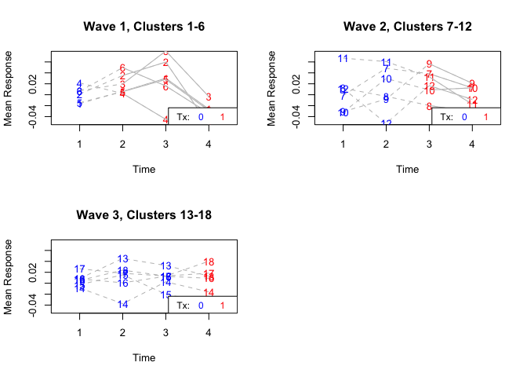

# Analyses of cluster randomized trials (CRTs) including stepped-wedge cluster randomized trials (SW-CRTs)
This is an (incomplete) excerpt from an Inserm France workshop, prepared and taught by the wonderful team in Tours and Bordeaux (Bruno Giraudeau, Laurent Billot, Agnès Caille and several of their PhD students).

## There are two general ways to analyse CRTs
1. On cluster level ("cluster level = unit of analysis")
This is done simply by comparing cluster level data (or aggregating individual level data on cluster level) across arms using simple tests (t-test, Wilcoxon, etc.). Recommended if total number of cluster small, i.e., below ~ 10.
2. On individual level ("individual level = unit of analysis")
This is more powerful and more flexible. And recommended when there are enough clusters.
There are two approaches:
* Using cluster-specific models, i.e., mixed-models (GLMM): Interpretation: effect if an individual moves from a control CLUSTER to intervention CLUSTER. -> conditional effect
* Using population-averaged models, i.e., Generalized estimating equations (GEE): Interpretation: effect if an individual from the target population moves from control to intervention. -> marginal effect
There is an entire literature on when/how to use both of these models, and their benefit/challenges, most use mixed-models. "GEE expert": Liz Turner (https://scholars.duke.edu/person/liz.turner/publications)
3. The same is true for SW-CRT, but more complex. In addition you need to account for time and the correlation structure is more complex. Check out: https://steppedwedgehog.blog/what-is-a-stepped-wedge-trial/

## ICC reporting
1. It is good practice to report the ICC (and its 95%CI) in the results publication of a CRT, at least for the primary outcome, better, for all outcomes. For other trialists to use it, see e.g., ICC database: https://monash-biostat.shinyapps.io/CLOUDbank/
2. It is good practice to report the ICC by arm.
3. There are several ways how to calculate the ICC, most straight-forward way is using one-way ANOVA by group

## Parallel CRT with baseline period
1. "A common enhancement of a simple parallel CRT is to add an assessment of participants’ outcomes in a baseline period (before randomisation). Even if different participants are assessed at baseline and follow-up [i.e. cross-sectional sampling], the fact that they are sampled from the same cluster allows some control for cluster differences." -> https://www.bmj.com/content/360/bmj.k1121.long 
2. This is illustratively shown in the sample size calculator: https://clusterrcts.shinyapps.io/rshinyapp/ (switch between "Parallel" and "Parallel with baseline measure") -> can yield a substantial increase in power! See last chapter below.

# Load packages

```r
library(tidyverse)
library(here)
library(readr)
library(sjPlot) # for tab_model()

library(lmerTest) # GLMM for CRTs with cont outcome: cluster-specific model (conditional)
library(geepack) # GEE for CRTs: population-averaged model (marginal) incl. sandwich estimator and exchangeable correlation structure
library(ICC) # one-way ANOVA for the calculation of the ICC, using mean squares within and between clusters
library(swCRTdesign) # stepped-wedge design plot
```

# Parallel CRT
We want to evaluate the impact of a 6-hours fasting period prior to extubation in mechanically ventilated intensive care patients. To this end, the AMBROISIE study has been set up. The "ambroisie.csv" database contains some of the variables collected as part of this trial. Patients are included in the study at the time of the medical decision to extubate. The primary endpoint was extubation failure (reintubation or death within 7 days of extubation). Caloric intake on the day before extubation was also recorded.
Sampling frame: cohort sampling (the same people recruited and followed up, but only assessed once, at the end)

## Variable description
1. CENTER : Center
2. PATIENT : Patient number in corresponding center
3. GROUP : Center randomization group
4. BMI : BMI
5. CALBEFORE : Caloric intake the day before extubation (kcal)
6. INTUBATIONJ7 : Reintubation before D7
7. DEATHJ7 : Death on D7
8. UNIVERSITY : University hospitals or not (stratification variable at the cluster level)

## Load data


## Continuous outcome

```r
# reformat
df$GROUP <- as.factor(df$GROUP)
df$CENTER <- as.factor(df$CENTER)

## Use outcome CALBEFORE: An intermediate outcome, on the causal pathway between randomisation and target outcome
# GLMM 
calintake.glmm <- lmer(CALBEFORE ~ (1|CENTER) + GROUP, data = df)
tab_model(calintake.glmm)
```

<table style="border-collapse:collapse; border:none;">
<tr>
<th style="border-top: double; text-align:center; font-style:normal; font-weight:bold; padding:0.2cm;  text-align:left; ">&nbsp;</th>
<th colspan="3" style="border-top: double; text-align:center; font-style:normal; font-weight:bold; padding:0.2cm; ">CALBEFORE</th>
</tr>
<tr>
<td style=" text-align:center; border-bottom:1px solid; font-style:italic; font-weight:normal;  text-align:left; ">Predictors</td>
<td style=" text-align:center; border-bottom:1px solid; font-style:italic; font-weight:normal;  ">Estimates</td>
<td style=" text-align:center; border-bottom:1px solid; font-style:italic; font-weight:normal;  ">CI</td>
<td style=" text-align:center; border-bottom:1px solid; font-style:italic; font-weight:normal;  ">p</td>
</tr>
<tr>
<td style=" padding:0.2cm; text-align:left; vertical-align:top; text-align:left; ">(Intercept)</td>
<td style=" padding:0.2cm; text-align:left; vertical-align:top; text-align:center;  ">1771.65</td>
<td style=" padding:0.2cm; text-align:left; vertical-align:top; text-align:center;  ">1666.16&nbsp;&ndash;&nbsp;1877.14</td>
<td style=" padding:0.2cm; text-align:left; vertical-align:top; text-align:center;  "><strong>&lt;0.001</strong></td>
</tr>
<tr>
<td style=" padding:0.2cm; text-align:left; vertical-align:top; text-align:left; ">GROUP2 × Fasting</td>
<td style=" padding:0.2cm; text-align:left; vertical-align:top; text-align:center;  ">&#45;284.03</td>
<td style=" padding:0.2cm; text-align:left; vertical-align:top; text-align:center;  ">&#45;436.01&nbsp;&ndash;&nbsp;-132.06</td>
<td style=" padding:0.2cm; text-align:left; vertical-align:top; text-align:center;  "><strong>&lt;0.001</strong></td>
</tr>
<tr>
<td colspan="4" style="font-weight:bold; text-align:left; padding-top:.8em;">Random Effects</td>
</tr>

<tr>
<td style=" padding:0.2cm; text-align:left; vertical-align:top; text-align:left; padding-top:0.1cm; padding-bottom:0.1cm;">&sigma;<sup>2</sup></td>
<td style=" padding:0.2cm; text-align:left; vertical-align:top; padding-top:0.1cm; padding-bottom:0.1cm; text-align:left;" colspan="3">341560.36</td>
</tr>

<tr>
<td style=" padding:0.2cm; text-align:left; vertical-align:top; text-align:left; padding-top:0.1cm; padding-bottom:0.1cm;">&tau;<sub>00</sub> <sub>CENTER</sub></td>
<td style=" padding:0.2cm; text-align:left; vertical-align:top; padding-top:0.1cm; padding-bottom:0.1cm; text-align:left;" colspan="3">25255.34</td>

<tr>
<td style=" padding:0.2cm; text-align:left; vertical-align:top; text-align:left; padding-top:0.1cm; padding-bottom:0.1cm;">ICC</td>
<td style=" padding:0.2cm; text-align:left; vertical-align:top; padding-top:0.1cm; padding-bottom:0.1cm; text-align:left;" colspan="3">0.07</td>

<tr>
<td style=" padding:0.2cm; text-align:left; vertical-align:top; text-align:left; padding-top:0.1cm; padding-bottom:0.1cm;">N <sub>CENTER</sub></td>
<td style=" padding:0.2cm; text-align:left; vertical-align:top; padding-top:0.1cm; padding-bottom:0.1cm; text-align:left;" colspan="3">22</td>
<tr>
<td style=" padding:0.2cm; text-align:left; vertical-align:top; text-align:left; padding-top:0.1cm; padding-bottom:0.1cm; border-top:1px solid;">Observations</td>
<td style=" padding:0.2cm; text-align:left; vertical-align:top; padding-top:0.1cm; padding-bottom:0.1cm; text-align:left; border-top:1px solid;" colspan="3">1130</td>
</tr>
<tr>
<td style=" padding:0.2cm; text-align:left; vertical-align:top; text-align:left; padding-top:0.1cm; padding-bottom:0.1cm;">Marginal R<sup>2</sup> / Conditional R<sup>2</sup></td>
<td style=" padding:0.2cm; text-align:left; vertical-align:top; padding-top:0.1cm; padding-bottom:0.1cm; text-align:left;" colspan="3">0.052 / 0.117</td>
</tr>

</table>

```r
# GEE
calintake.gee <- geeglm(CALBEFORE ~ GROUP, id = CENTER, data = df, corstr = "exchangeable")
tab_model(calintake.gee) # same as GLMM
```

<table style="border-collapse:collapse; border:none;">
<tr>
<th style="border-top: double; text-align:center; font-style:normal; font-weight:bold; padding:0.2cm;  text-align:left; ">&nbsp;</th>
<th colspan="3" style="border-top: double; text-align:center; font-style:normal; font-weight:bold; padding:0.2cm; ">CALBEFORE</th>
</tr>
<tr>
<td style=" text-align:center; border-bottom:1px solid; font-style:italic; font-weight:normal;  text-align:left; ">Predictors</td>
<td style=" text-align:center; border-bottom:1px solid; font-style:italic; font-weight:normal;  ">Estimates</td>
<td style=" text-align:center; border-bottom:1px solid; font-style:italic; font-weight:normal;  ">CI</td>
<td style=" text-align:center; border-bottom:1px solid; font-style:italic; font-weight:normal;  ">p</td>
</tr>
<tr>
<td style=" padding:0.2cm; text-align:left; vertical-align:top; text-align:left; ">(Intercept)</td>
<td style=" padding:0.2cm; text-align:left; vertical-align:top; text-align:center;  ">1771.52</td>
<td style=" padding:0.2cm; text-align:left; vertical-align:top; text-align:center;  ">1670.23&nbsp;&ndash;&nbsp;1872.82</td>
<td style=" padding:0.2cm; text-align:left; vertical-align:top; text-align:center;  "><strong>&lt;0.001</strong></td>
</tr>
<tr>
<td style=" padding:0.2cm; text-align:left; vertical-align:top; text-align:left; ">GROUP2 × Fasting</td>
<td style=" padding:0.2cm; text-align:left; vertical-align:top; text-align:center;  ">&#45;284.14</td>
<td style=" padding:0.2cm; text-align:left; vertical-align:top; text-align:center;  ">&#45;428.88&nbsp;&ndash;&nbsp;-139.40</td>
<td style=" padding:0.2cm; text-align:left; vertical-align:top; text-align:center;  "><strong>&lt;0.001</strong></td>
</tr>

<tr>
<td style=" padding:0.2cm; text-align:left; vertical-align:top; text-align:left; padding-top:0.1cm; padding-bottom:0.1cm;">N <sub>CENTER</sub></td>
<td style=" padding:0.2cm; text-align:left; vertical-align:top; padding-top:0.1cm; padding-bottom:0.1cm; text-align:left;" colspan="3">22</td>
<tr>
<td style=" padding:0.2cm; text-align:left; vertical-align:top; text-align:left; padding-top:0.1cm; padding-bottom:0.1cm; border-top:1px solid;">Observations</td>
<td style=" padding:0.2cm; text-align:left; vertical-align:top; padding-top:0.1cm; padding-bottom:0.1cm; text-align:left; border-top:1px solid;" colspan="3">1130</td>
</tr>

</table>

```r
# GLMM, adjusted for BMI
calintake.glmm.bmi <- lmer(CALBEFORE ~ (1|CENTER) + GROUP + BMI, data = df)
# GEE, adjusted for BMI
calintake.gee.bmi <- geeglm(CALBEFORE ~ GROUP + BMI, id = CENTER, data = df, corstr = "exchangeable")

# ICC directly from GLMM model
ICC_BMI_unadj <- 158.9^2/(158.9^2+584.4^2) # but this is misleading, since conditioned on intervention!
ICC_BMI_adj <- 157.7^2/(157.7^2+579.8^2) # but this is misleading, since conditioned on intervention!
# => ICC directly from GLMM without conditioning on intervention
calintake.glmm.uncond <- lmer(CALBEFORE ~ (1|CENTER) + 1,
                   data = df)
ICC_BMI_unadj_uncond <- 210.4^2/(210.4^2+584.5^2) # but this does not provide 95%CI, and is not by group
# However, it is the same ICC as from one-way ANOVA overall
ICCest(x = CENTER, y = CALBEFORE, data = df, alpha = 0.05, CI.type = "THD") # ~ same as above, ICC ~ 0.11
```

```
## $ICC
## [1] 0.1164643
## 
## $LowerCI
## [1] 0.06486855
## 
## $UpperCI
## [1] 0.2252985
## 
## $N
## [1] 22
## 
## $k
## [1] 51.06574
## 
## $varw
## [1] 341767.7
## 
## $vara
## [1] 45050.49
```

```r
# One-way ANOVA ICC by group -> Gold standard to report ICC by group
ICCest(x = CENTER, y = CALBEFORE, data = df[df$GROUP == "1: Maintaining caloric intake",], alpha = 0.05, CI.type = "THD") # ICC control group
```

```
## $ICC
## [1] 0.08037775
## 
## $LowerCI
## [1] 0.03190476
## 
## $UpperCI
## [1] 0.2353509
## 
## $N
## [1] 11
## 
## $k
## [1] 55.70243
## 
## $varw
## [1] 323114.5
## 
## $vara
## [1] 28241.18
```

```r
ICCest(x = CENTER, y = CALBEFORE, data = df[df$GROUP == "2: Fasting",], alpha = 0.05, CI.type = "THD") # ICC intervention group
```

```
## $ICC
## [1] 0.05973571
## 
## $LowerCI
## [1] 0.01896594
## 
## $UpperCI
## [1] 0.1950354
## 
## $N
## [1] 11
## 
## $k
## [1] 45.82144
## 
## $varw
## [1] 364285.3
## 
## $vara
## [1] 23143.33
```

```r
# ICC from GEE model
calintake.gee.uncond <- geeglm(CALBEFORE ~ 1, id = CENTER, data = df, corstr = "exchangeable")
calintake.gee.uncond # See Estimated Correlation Parameters (alpha), the same: ICC ~ 0.11 // 95%CI ?
```

```
## 
## Call:
## geeglm(formula = CALBEFORE ~ 1, data = df, id = CENTER, corstr = "exchangeable")
## 
## Coefficients:
## (Intercept) 
##     1634.43 
## 
## Degrees of Freedom: 1130 Total (i.e. Null);  1129 Residual
## 
## Scale Link:                   identity
## Estimated Scale Parameters:  [1] 384218.7
## 
## Correlation:  Structure = exchangeable    Link = identity 
## Estimated Correlation Parameters:
##     alpha 
## 0.1076625 
## 
## Number of clusters:   22   Maximum cluster size: 70
```

```r
calintake.gee.uncond.cont <- geeglm(CALBEFORE ~ 1, id = CENTER, data = df[df$GROUP == "1: Maintaining caloric intake",], corstr = "exchangeable") # ICC control group
calintake.gee.uncond.int <- geeglm(CALBEFORE ~ 1, id = CENTER, data = df[df$GROUP == "2: Fasting",], corstr = "exchangeable") # ICC intervention group
```

## Binary outcome

```r
## binary outcome: Reintubation or death (the target trial outcome)
df <- df %>% # Create the variable outcome, which is equal to 1 for failure and 0 for success. => "Failure rate"
  mutate(outcome = case_when(INTUBATIONJ7 == 0 & DEATHJ7 == 0 ~ 0,
                             INTUBATIONJ7 == 1 | DEATHJ7 == 1 ~ 1))

# GLMM, the effect of the intervention on the failure rate
outcome.glmm <- glmer(outcome ~ (1|CENTER) + GROUP, data = df, family = "binomial")
tab_model(outcome.glmm)
```

<table style="border-collapse:collapse; border:none;">
<tr>
<th style="border-top: double; text-align:center; font-style:normal; font-weight:bold; padding:0.2cm;  text-align:left; ">&nbsp;</th>
<th colspan="3" style="border-top: double; text-align:center; font-style:normal; font-weight:bold; padding:0.2cm; ">outcome</th>
</tr>
<tr>
<td style=" text-align:center; border-bottom:1px solid; font-style:italic; font-weight:normal;  text-align:left; ">Predictors</td>
<td style=" text-align:center; border-bottom:1px solid; font-style:italic; font-weight:normal;  ">Odds Ratios</td>
<td style=" text-align:center; border-bottom:1px solid; font-style:italic; font-weight:normal;  ">CI</td>
<td style=" text-align:center; border-bottom:1px solid; font-style:italic; font-weight:normal;  ">p</td>
</tr>
<tr>
<td style=" padding:0.2cm; text-align:left; vertical-align:top; text-align:left; ">(Intercept)</td>
<td style=" padding:0.2cm; text-align:left; vertical-align:top; text-align:center;  ">0.21</td>
<td style=" padding:0.2cm; text-align:left; vertical-align:top; text-align:center;  ">0.16&nbsp;&ndash;&nbsp;0.26</td>
<td style=" padding:0.2cm; text-align:left; vertical-align:top; text-align:center;  "><strong>&lt;0.001</strong></td>
</tr>
<tr>
<td style=" padding:0.2cm; text-align:left; vertical-align:top; text-align:left; ">GROUP2 × Fasting</td>
<td style=" padding:0.2cm; text-align:left; vertical-align:top; text-align:center;  ">1.03</td>
<td style=" padding:0.2cm; text-align:left; vertical-align:top; text-align:center;  ">0.74&nbsp;&ndash;&nbsp;1.43</td>
<td style=" padding:0.2cm; text-align:left; vertical-align:top; text-align:center;  ">0.877</td>
</tr>
<tr>
<td colspan="4" style="font-weight:bold; text-align:left; padding-top:.8em;">Random Effects</td>
</tr>

<tr>
<td style=" padding:0.2cm; text-align:left; vertical-align:top; text-align:left; padding-top:0.1cm; padding-bottom:0.1cm;">&sigma;<sup>2</sup></td>
<td style=" padding:0.2cm; text-align:left; vertical-align:top; padding-top:0.1cm; padding-bottom:0.1cm; text-align:left;" colspan="3">3.29</td>
</tr>

<tr>
<td style=" padding:0.2cm; text-align:left; vertical-align:top; text-align:left; padding-top:0.1cm; padding-bottom:0.1cm;">&tau;<sub>00</sub> <sub>CENTER</sub></td>
<td style=" padding:0.2cm; text-align:left; vertical-align:top; padding-top:0.1cm; padding-bottom:0.1cm; text-align:left;" colspan="3">0.02</td>

<tr>
<td style=" padding:0.2cm; text-align:left; vertical-align:top; text-align:left; padding-top:0.1cm; padding-bottom:0.1cm;">ICC</td>
<td style=" padding:0.2cm; text-align:left; vertical-align:top; padding-top:0.1cm; padding-bottom:0.1cm; text-align:left;" colspan="3">0.01</td>

<tr>
<td style=" padding:0.2cm; text-align:left; vertical-align:top; text-align:left; padding-top:0.1cm; padding-bottom:0.1cm;">N <sub>CENTER</sub></td>
<td style=" padding:0.2cm; text-align:left; vertical-align:top; padding-top:0.1cm; padding-bottom:0.1cm; text-align:left;" colspan="3">22</td>
<tr>
<td style=" padding:0.2cm; text-align:left; vertical-align:top; text-align:left; padding-top:0.1cm; padding-bottom:0.1cm; border-top:1px solid;">Observations</td>
<td style=" padding:0.2cm; text-align:left; vertical-align:top; padding-top:0.1cm; padding-bottom:0.1cm; text-align:left; border-top:1px solid;" colspan="3">1130</td>
</tr>
<tr>
<td style=" padding:0.2cm; text-align:left; vertical-align:top; text-align:left; padding-top:0.1cm; padding-bottom:0.1cm;">Marginal R<sup>2</sup> / Conditional R<sup>2</sup></td>
<td style=" padding:0.2cm; text-align:left; vertical-align:top; padding-top:0.1cm; padding-bottom:0.1cm; text-align:left;" colspan="3">0.000 / 0.006</td>
</tr>

</table>

```r
# GEE, the effect of the intervention on the failure rate
outcome.gee <- geeglm(outcome ~ GROUP, id = CENTER, data = df, corstr = "exchangeable", family = "binomial")
tab_model(outcome.gee) # same result as GLMM
```

<table style="border-collapse:collapse; border:none;">
<tr>
<th style="border-top: double; text-align:center; font-style:normal; font-weight:bold; padding:0.2cm;  text-align:left; ">&nbsp;</th>
<th colspan="3" style="border-top: double; text-align:center; font-style:normal; font-weight:bold; padding:0.2cm; ">outcome</th>
</tr>
<tr>
<td style=" text-align:center; border-bottom:1px solid; font-style:italic; font-weight:normal;  text-align:left; ">Predictors</td>
<td style=" text-align:center; border-bottom:1px solid; font-style:italic; font-weight:normal;  ">Odds Ratios</td>
<td style=" text-align:center; border-bottom:1px solid; font-style:italic; font-weight:normal;  ">CI</td>
<td style=" text-align:center; border-bottom:1px solid; font-style:italic; font-weight:normal;  ">p</td>
</tr>
<tr>
<td style=" padding:0.2cm; text-align:left; vertical-align:top; text-align:left; ">(Intercept)</td>
<td style=" padding:0.2cm; text-align:left; vertical-align:top; text-align:center;  ">0.21</td>
<td style=" padding:0.2cm; text-align:left; vertical-align:top; text-align:center;  ">0.17&nbsp;&ndash;&nbsp;0.26</td>
<td style=" padding:0.2cm; text-align:left; vertical-align:top; text-align:center;  "><strong>&lt;0.001</strong></td>
</tr>
<tr>
<td style=" padding:0.2cm; text-align:left; vertical-align:top; text-align:left; ">GROUP2 × Fasting</td>
<td style=" padding:0.2cm; text-align:left; vertical-align:top; text-align:center;  ">1.03</td>
<td style=" padding:0.2cm; text-align:left; vertical-align:top; text-align:center;  ">0.74&nbsp;&ndash;&nbsp;1.43</td>
<td style=" padding:0.2cm; text-align:left; vertical-align:top; text-align:center;  ">0.877</td>
</tr>

<tr>
<td style=" padding:0.2cm; text-align:left; vertical-align:top; text-align:left; padding-top:0.1cm; padding-bottom:0.1cm;">N <sub>CENTER</sub></td>
<td style=" padding:0.2cm; text-align:left; vertical-align:top; padding-top:0.1cm; padding-bottom:0.1cm; text-align:left;" colspan="3">22</td>
<tr>
<td style=" padding:0.2cm; text-align:left; vertical-align:top; text-align:left; padding-top:0.1cm; padding-bottom:0.1cm; border-top:1px solid;">Observations</td>
<td style=" padding:0.2cm; text-align:left; vertical-align:top; padding-top:0.1cm; padding-bottom:0.1cm; text-align:left; border-top:1px solid;" colspan="3">1130</td>
</tr>

</table>

```r
# GLMM, adjusted for BMI
outcome.glmm.bmi <- glmer(outcome ~ (1|CENTER) + GROUP + BMI, data = df, family = "binomial")
# GEE, adjusted for BMI
outcome.gee.bmi <- geeglm(outcome ~ GROUP + BMI, id = CENTER, data = df, corstr = "exchangeable", family = "binomial")

# Gold standard: Report one-way ANOVA ICC by group // GLMM
ICCest(x = CENTER, y = outcome, data = df[df$GROUP == "1: Maintaining caloric intake",], alpha = 0.05, CI.type = "THD")
```

```
## $ICC
## [1] 0.002250531
## 
## $LowerCI
## [1] -0.008255373
## 
## $UpperCI
## [1] 0.04262951
## 
## $N
## [1] 11
## 
## $k
## [1] 55.70243
## 
## $varw
## [1] 0.142225
## 
## $vara
## [1] 0.0003208038
```

```r
ICCest(x = CENTER, y = outcome, data = df[df$GROUP == "2: Fasting",], alpha = 0.05, CI.type = "THD")
```

```
## $ICC
## [1] 0.008011138
## 
## $LowerCI
## [1] -0.007462032
## 
## $UpperCI
## [1] 0.06602751
## 
## $N
## [1] 11
## 
## $k
## [1] 45.82144
## 
## $varw
## [1] 0.1439024
## 
## $vara
## [1] 0.001162132
```

```r
## overall ICC (but conditioned on the intervention!)
ICCest(x = CENTER, y = outcome, data = df, alpha = 0.05, CI.type = "THD")
```

```
## $ICC
## [1] 0.003726263
## 
## $LowerCI
## [1] -0.00591458
## 
## $UpperCI
## [1] 0.02745922
## 
## $N
## [1] 22
## 
## $k
## [1] 51.06574
## 
## $varw
## [1] 0.142985
## 
## $vara
## [1] 0.0005347924
```

```r
# Gold standard: Report one-way ANOVA ICC by group // GEE
calintake.gee.uncond.cont <- geeglm(outcome ~ 1, id = CENTER, data = df[df$GROUP == "1: Maintaining caloric intake",], corstr = "exchangeable", family = "binomial")
calintake.gee.uncond.int <- geeglm(outcome ~ 1, id = CENTER, data = df[df$GROUP == "2: Fasting",], corstr = "exchangeable", family = "binomial")
```

# SW-CRTs
Trial publication: https://pubmed.ncbi.nlm.nih.gov/30913216/

## Variable description
1. phc_code: Eighteen primary health centre (1 to 18), CLUSTER
2. PHASE: Time Period (1=6months, 2=12months, 3=18months, 4=24months) // "VERTICAL"
3. block: 3 sequences, each includes 6 PHCs, unit of randomization // "HORIZONTAL"
4. TRT:	Treatment allocation
5. primary_event:	primary, binary, outcome (SBP<140mmHg)
6. EQUK_change:	EQUK change from baseline to endline (a secondary, cont, outcome)

## Load data

```r
df <- read_delim("SMART.csv", delim = ";", 
    escape_double = FALSE, trim_ws = TRUE)
```

## Binary outcome (primary outcome)

```r
# reformat
df$primary_event_f <- as.factor(df$primary_event)
df$TRT_f <- as.factor(df$TRT)
df$PHASE_f <- as.factor(df$PHASE)

df$phc_code <- as.factor(df$phc_code) # always a factor
df$phc_code_modif <- as.factor(df$phc_code_modif) # only used for the SWplot

df <- df %>%
  mutate(primary_event_n = case_when(primary_event == "No" ~ 0,
                             primary_event == "Yes" ~ 1))
df <- df %>%
  mutate(TRT_n = case_when(TRT == "Control" ~ 0,
                             TRT == "Intervention" ~ 1))

# SW plot
swPlot(EQUK_change, TRT_n, PHASE_f, phc_code_modif, df, by.wave=FALSE,
       combined.plot=FALSE, 
       choose.tx.pos="bottomright",
       choose.legend.pos="bottom")

# table(df$PHASE,df$TRT)
# table(df$block,df$TRT) # block = sequence = randomised. Important: Different to a parallel CRT (or individual RCT) the randomized group variable is not used in the model

# GLMM
outcome.glmm <- glmer(primary_event_f ~ (1|phc_code) + TRT_f + PHASE_f, data = df, family = "binomial")
tab_model(outcome.glmm)
```

<table style="border-collapse:collapse; border:none;">
<tr>
<th style="border-top: double; text-align:center; font-style:normal; font-weight:bold; padding:0.2cm;  text-align:left; ">&nbsp;</th>
<th colspan="3" style="border-top: double; text-align:center; font-style:normal; font-weight:bold; padding:0.2cm; ">primary event f</th>
</tr>
<tr>
<td style=" text-align:center; border-bottom:1px solid; font-style:italic; font-weight:normal;  text-align:left; ">Predictors</td>
<td style=" text-align:center; border-bottom:1px solid; font-style:italic; font-weight:normal;  ">Odds Ratios</td>
<td style=" text-align:center; border-bottom:1px solid; font-style:italic; font-weight:normal;  ">CI</td>
<td style=" text-align:center; border-bottom:1px solid; font-style:italic; font-weight:normal;  ">p</td>
</tr>
<tr>
<td style=" padding:0.2cm; text-align:left; vertical-align:top; text-align:left; ">(Intercept)</td>
<td style=" padding:0.2cm; text-align:left; vertical-align:top; text-align:center;  ">0.51</td>
<td style=" padding:0.2cm; text-align:left; vertical-align:top; text-align:center;  ">0.46&nbsp;&ndash;&nbsp;0.57</td>
<td style=" padding:0.2cm; text-align:left; vertical-align:top; text-align:center;  "><strong>&lt;0.001</strong></td>
</tr>
<tr>
<td style=" padding:0.2cm; text-align:left; vertical-align:top; text-align:left; ">TRT f [Intervention]</td>
<td style=" padding:0.2cm; text-align:left; vertical-align:top; text-align:center;  ">1.00</td>
<td style=" padding:0.2cm; text-align:left; vertical-align:top; text-align:center;  ">0.86&nbsp;&ndash;&nbsp;1.17</td>
<td style=" padding:0.2cm; text-align:left; vertical-align:top; text-align:center;  ">0.955</td>
</tr>
<tr>
<td style=" padding:0.2cm; text-align:left; vertical-align:top; text-align:left; ">PHASE f [2]</td>
<td style=" padding:0.2cm; text-align:left; vertical-align:top; text-align:center;  ">1.86</td>
<td style=" padding:0.2cm; text-align:left; vertical-align:top; text-align:center;  ">1.63&nbsp;&ndash;&nbsp;2.12</td>
<td style=" padding:0.2cm; text-align:left; vertical-align:top; text-align:center;  "><strong>&lt;0.001</strong></td>
</tr>
<tr>
<td style=" padding:0.2cm; text-align:left; vertical-align:top; text-align:left; ">PHASE f [3]</td>
<td style=" padding:0.2cm; text-align:left; vertical-align:top; text-align:center;  ">1.08</td>
<td style=" padding:0.2cm; text-align:left; vertical-align:top; text-align:center;  ">0.92&nbsp;&ndash;&nbsp;1.27</td>
<td style=" padding:0.2cm; text-align:left; vertical-align:top; text-align:center;  ">0.355</td>
</tr>
<tr>
<td style=" padding:0.2cm; text-align:left; vertical-align:top; text-align:left; ">PHASE f [4]</td>
<td style=" padding:0.2cm; text-align:left; vertical-align:top; text-align:center;  ">1.47</td>
<td style=" padding:0.2cm; text-align:left; vertical-align:top; text-align:center;  ">1.21&nbsp;&ndash;&nbsp;1.79</td>
<td style=" padding:0.2cm; text-align:left; vertical-align:top; text-align:center;  "><strong>&lt;0.001</strong></td>
</tr>
<tr>
<td colspan="4" style="font-weight:bold; text-align:left; padding-top:.8em;">Random Effects</td>
</tr>

<tr>
<td style=" padding:0.2cm; text-align:left; vertical-align:top; text-align:left; padding-top:0.1cm; padding-bottom:0.1cm;">&sigma;<sup>2</sup></td>
<td style=" padding:0.2cm; text-align:left; vertical-align:top; padding-top:0.1cm; padding-bottom:0.1cm; text-align:left;" colspan="3">3.29</td>
</tr>

<tr>
<td style=" padding:0.2cm; text-align:left; vertical-align:top; text-align:left; padding-top:0.1cm; padding-bottom:0.1cm;">&tau;<sub>00</sub> <sub>phc_code</sub></td>
<td style=" padding:0.2cm; text-align:left; vertical-align:top; padding-top:0.1cm; padding-bottom:0.1cm; text-align:left;" colspan="3">0.01</td>

<tr>
<td style=" padding:0.2cm; text-align:left; vertical-align:top; text-align:left; padding-top:0.1cm; padding-bottom:0.1cm;">ICC</td>
<td style=" padding:0.2cm; text-align:left; vertical-align:top; padding-top:0.1cm; padding-bottom:0.1cm; text-align:left;" colspan="3">0.00</td>

<tr>
<td style=" padding:0.2cm; text-align:left; vertical-align:top; text-align:left; padding-top:0.1cm; padding-bottom:0.1cm;">N <sub>phc_code</sub></td>
<td style=" padding:0.2cm; text-align:left; vertical-align:top; padding-top:0.1cm; padding-bottom:0.1cm; text-align:left;" colspan="3">18</td>
<tr>
<td style=" padding:0.2cm; text-align:left; vertical-align:top; text-align:left; padding-top:0.1cm; padding-bottom:0.1cm; border-top:1px solid;">Observations</td>
<td style=" padding:0.2cm; text-align:left; vertical-align:top; padding-top:0.1cm; padding-bottom:0.1cm; text-align:left; border-top:1px solid;" colspan="3">8642</td>
</tr>
<tr>
<td style=" padding:0.2cm; text-align:left; vertical-align:top; text-align:left; padding-top:0.1cm; padding-bottom:0.1cm;">Marginal R<sup>2</sup> / Conditional R<sup>2</sup></td>
<td style=" padding:0.2cm; text-align:left; vertical-align:top; padding-top:0.1cm; padding-bottom:0.1cm; text-align:left;" colspan="3">0.018 / 0.023</td>
</tr>

</table>

```r
# GEE - what the authors used in the publication // takes ~ 1min to converge
outcome.gee <- geeglm(primary_event_n ~ TRT_f + PHASE_f, id = phc_code, data = df, corstr = "exchangeable", family = "binomial")
tab_model(outcome.gee) # same as in publication
```

<table style="border-collapse:collapse; border:none;">
<tr>
<th style="border-top: double; text-align:center; font-style:normal; font-weight:bold; padding:0.2cm;  text-align:left; ">&nbsp;</th>
<th colspan="3" style="border-top: double; text-align:center; font-style:normal; font-weight:bold; padding:0.2cm; ">primary event n</th>
</tr>
<tr>
<td style=" text-align:center; border-bottom:1px solid; font-style:italic; font-weight:normal;  text-align:left; ">Predictors</td>
<td style=" text-align:center; border-bottom:1px solid; font-style:italic; font-weight:normal;  ">Odds Ratios</td>
<td style=" text-align:center; border-bottom:1px solid; font-style:italic; font-weight:normal;  ">CI</td>
<td style=" text-align:center; border-bottom:1px solid; font-style:italic; font-weight:normal;  ">p</td>
</tr>
<tr>
<td style=" padding:0.2cm; text-align:left; vertical-align:top; text-align:left; ">(Intercept)</td>
<td style=" padding:0.2cm; text-align:left; vertical-align:top; text-align:center;  ">0.51</td>
<td style=" padding:0.2cm; text-align:left; vertical-align:top; text-align:center;  ">0.45&nbsp;&ndash;&nbsp;0.58</td>
<td style=" padding:0.2cm; text-align:left; vertical-align:top; text-align:center;  "><strong>&lt;0.001</strong></td>
</tr>
<tr>
<td style=" padding:0.2cm; text-align:left; vertical-align:top; text-align:left; ">TRT f [Intervention]</td>
<td style=" padding:0.2cm; text-align:left; vertical-align:top; text-align:center;  ">1.01</td>
<td style=" padding:0.2cm; text-align:left; vertical-align:top; text-align:center;  ">0.80&nbsp;&ndash;&nbsp;1.26</td>
<td style=" padding:0.2cm; text-align:left; vertical-align:top; text-align:center;  ">0.961</td>
</tr>
<tr>
<td style=" padding:0.2cm; text-align:left; vertical-align:top; text-align:left; ">PHASE f [2]</td>
<td style=" padding:0.2cm; text-align:left; vertical-align:top; text-align:center;  ">1.85</td>
<td style=" padding:0.2cm; text-align:left; vertical-align:top; text-align:center;  ">1.54&nbsp;&ndash;&nbsp;2.23</td>
<td style=" padding:0.2cm; text-align:left; vertical-align:top; text-align:center;  "><strong>&lt;0.001</strong></td>
</tr>
<tr>
<td style=" padding:0.2cm; text-align:left; vertical-align:top; text-align:left; ">PHASE f [3]</td>
<td style=" padding:0.2cm; text-align:left; vertical-align:top; text-align:center;  ">1.08</td>
<td style=" padding:0.2cm; text-align:left; vertical-align:top; text-align:center;  ">0.87&nbsp;&ndash;&nbsp;1.33</td>
<td style=" padding:0.2cm; text-align:left; vertical-align:top; text-align:center;  ">0.494</td>
</tr>
<tr>
<td style=" padding:0.2cm; text-align:left; vertical-align:top; text-align:left; ">PHASE f [4]</td>
<td style=" padding:0.2cm; text-align:left; vertical-align:top; text-align:center;  ">1.47</td>
<td style=" padding:0.2cm; text-align:left; vertical-align:top; text-align:center;  ">1.15&nbsp;&ndash;&nbsp;1.87</td>
<td style=" padding:0.2cm; text-align:left; vertical-align:top; text-align:center;  "><strong>0.002</strong></td>
</tr>

<tr>
<td style=" padding:0.2cm; text-align:left; vertical-align:top; text-align:left; padding-top:0.1cm; padding-bottom:0.1cm;">N <sub>phc_code</sub></td>
<td style=" padding:0.2cm; text-align:left; vertical-align:top; padding-top:0.1cm; padding-bottom:0.1cm; text-align:left;" colspan="3">18</td>
<tr>
<td style=" padding:0.2cm; text-align:left; vertical-align:top; text-align:left; padding-top:0.1cm; padding-bottom:0.1cm; border-top:1px solid;">Observations</td>
<td style=" padding:0.2cm; text-align:left; vertical-align:top; padding-top:0.1cm; padding-bottom:0.1cm; text-align:left; border-top:1px solid;" colspan="3">8642</td>
</tr>

</table>

```r
# Note: think about decaying correlation structure
```

<!-- -->

# Parallel CRT with baseline period
Based on: https://www.bmj.com/content/360/bmj.k1121.long
Using data from PEBRA trial.
1. Trial publication: https://journals.plos.org/plosmedicine/article?id=10.1371/journal.pmed.1004150
2. Trial code repo: https://github.com/alainamstutz/pebra 

## There are various ways to do it:
1. Analysis of covariance (ANCOVA): Aggregate outcomes at baseline, and adjusts each individual participant at follow-up for the baseline cluster mean
2. Constrained baseline analysis: Treat outcomes collected at baseline and follow-up as longitudinal, and to use a repeated measures analysis to estimate the effect of the intervention being switched on in one of the randomised groups on the second of these occasions, see design matrix in https://clusterrcts.shinyapps.io/rshinyapp/. Unlike a difference of differences analysis, it assumes that there is no systematic difference between the groups at baseline.

## Load data

```r
df <- readRDS("df_pebra.RData")
```

## Primary model, without baseline period

```r
# ITT model on primary endpoint (viral load), see publication
vs <- glmer(endpoint_reached ~ ARM + (1|USER) + DISTRICT + GENDER, data = df,
              family = "binomial")
```

```
## boundary (singular) fit: see help('isSingular')
```

```r
tab_model(vs)
```

<table style="border-collapse:collapse; border:none;">
<tr>
<th style="border-top: double; text-align:center; font-style:normal; font-weight:bold; padding:0.2cm;  text-align:left; ">&nbsp;</th>
<th colspan="3" style="border-top: double; text-align:center; font-style:normal; font-weight:bold; padding:0.2cm; ">endpoint reached</th>
</tr>
<tr>
<td style=" text-align:center; border-bottom:1px solid; font-style:italic; font-weight:normal;  text-align:left; ">Predictors</td>
<td style=" text-align:center; border-bottom:1px solid; font-style:italic; font-weight:normal;  ">Odds Ratios</td>
<td style=" text-align:center; border-bottom:1px solid; font-style:italic; font-weight:normal;  ">CI</td>
<td style=" text-align:center; border-bottom:1px solid; font-style:italic; font-weight:normal;  ">p</td>
</tr>
<tr>
<td style=" padding:0.2cm; text-align:left; vertical-align:top; text-align:left; ">(Intercept)</td>
<td style=" padding:0.2cm; text-align:left; vertical-align:top; text-align:center;  ">1.93</td>
<td style=" padding:0.2cm; text-align:left; vertical-align:top; text-align:center;  ">1.26&nbsp;&ndash;&nbsp;2.97</td>
<td style=" padding:0.2cm; text-align:left; vertical-align:top; text-align:center;  "><strong>0.003</strong></td>
</tr>
<tr>
<td style=" padding:0.2cm; text-align:left; vertical-align:top; text-align:left; ">ARM [interv.]</td>
<td style=" padding:0.2cm; text-align:left; vertical-align:top; text-align:center;  ">1.27</td>
<td style=" padding:0.2cm; text-align:left; vertical-align:top; text-align:center;  ">0.79&nbsp;&ndash;&nbsp;2.03</td>
<td style=" padding:0.2cm; text-align:left; vertical-align:top; text-align:center;  ">0.327</td>
</tr>
<tr>
<td style=" padding:0.2cm; text-align:left; vertical-align:top; text-align:left; ">DISTRICT [Leribe]</td>
<td style=" padding:0.2cm; text-align:left; vertical-align:top; text-align:center;  ">0.71</td>
<td style=" padding:0.2cm; text-align:left; vertical-align:top; text-align:center;  ">0.34&nbsp;&ndash;&nbsp;1.49</td>
<td style=" padding:0.2cm; text-align:left; vertical-align:top; text-align:center;  ">0.370</td>
</tr>
<tr>
<td style=" padding:0.2cm; text-align:left; vertical-align:top; text-align:left; ">DISTRICT [MKG]</td>
<td style=" padding:0.2cm; text-align:left; vertical-align:top; text-align:center;  ">0.59</td>
<td style=" padding:0.2cm; text-align:left; vertical-align:top; text-align:center;  ">0.36&nbsp;&ndash;&nbsp;0.98</td>
<td style=" padding:0.2cm; text-align:left; vertical-align:top; text-align:center;  "><strong>0.040</strong></td>
</tr>
<tr>
<td style=" padding:0.2cm; text-align:left; vertical-align:top; text-align:left; ">GENDER [male]</td>
<td style=" padding:0.2cm; text-align:left; vertical-align:top; text-align:center;  ">1.11</td>
<td style=" padding:0.2cm; text-align:left; vertical-align:top; text-align:center;  ">0.66&nbsp;&ndash;&nbsp;1.88</td>
<td style=" padding:0.2cm; text-align:left; vertical-align:top; text-align:center;  ">0.688</td>
</tr>
<tr>
<td colspan="4" style="font-weight:bold; text-align:left; padding-top:.8em;">Random Effects</td>
</tr>

<tr>
<td style=" padding:0.2cm; text-align:left; vertical-align:top; text-align:left; padding-top:0.1cm; padding-bottom:0.1cm;">&sigma;<sup>2</sup></td>
<td style=" padding:0.2cm; text-align:left; vertical-align:top; padding-top:0.1cm; padding-bottom:0.1cm; text-align:left;" colspan="3">3.29</td>
</tr>

<tr>
<td style=" padding:0.2cm; text-align:left; vertical-align:top; text-align:left; padding-top:0.1cm; padding-bottom:0.1cm;">&tau;<sub>00</sub> <sub>USER</sub></td>
<td style=" padding:0.2cm; text-align:left; vertical-align:top; padding-top:0.1cm; padding-bottom:0.1cm; text-align:left;" colspan="3">0.00</td>

<tr>
<td style=" padding:0.2cm; text-align:left; vertical-align:top; text-align:left; padding-top:0.1cm; padding-bottom:0.1cm;">N <sub>USER</sub></td>
<td style=" padding:0.2cm; text-align:left; vertical-align:top; padding-top:0.1cm; padding-bottom:0.1cm; text-align:left;" colspan="3">20</td>
<tr>
<td style=" padding:0.2cm; text-align:left; vertical-align:top; text-align:left; padding-top:0.1cm; padding-bottom:0.1cm; border-top:1px solid;">Observations</td>
<td style=" padding:0.2cm; text-align:left; vertical-align:top; padding-top:0.1cm; padding-bottom:0.1cm; text-align:left; border-top:1px solid;" colspan="3">307</td>
</tr>
<tr>
<td style=" padding:0.2cm; text-align:left; vertical-align:top; text-align:left; padding-top:0.1cm; padding-bottom:0.1cm;">Marginal R<sup>2</sup> / Conditional R<sup>2</sup></td>
<td style=" padding:0.2cm; text-align:left; vertical-align:top; padding-top:0.1cm; padding-bottom:0.1cm; text-align:left;" colspan="3">0.023 / NA</td>
</tr>

</table>

## With baseline period: Analysis of covariance

```r
# Calculate the mean cluster value of the baseline viral load
df$VL_RESULT_baseline <- as.numeric(df$VL_RESULT_baseline)
df <- df %>% # there are several baseline VL variables, to force <20 into 0 is not ideal, but best we can do.
  mutate(baseline_Vl_num = case_when(baseline_Vl_cat == "<20" ~ 0,
                                     baseline_Vl_cat == ">999" ~ VL_RESULT_baseline,
                                     baseline_Vl_cat == "20-999" ~ VL_RESULT_baseline))
cluster_mean <- df %>%
  group_by(USER) %>%
  drop_na(baseline_Vl_num) %>% 
  summarize(baseline_Vl_meanUSER = mean(baseline_Vl_num))
df <- left_join(df, cluster_mean[, c("baseline_Vl_meanUSER", "USER")], by = join_by(USER == USER))

# individual-level ANCOVA with cluster-level adjustment
vs.ancova <- glmer(endpoint_reached ~ DISTRICT + ARM + GENDER + (1|USER) + baseline_Vl_meanUSER, 
              data = df, family = "binomial")
# tab_model(vs.ancova)
# not ideal, due to cluster level aggregation of viral load categories
```

## With baseline period: Constrained baseline analysis
Two possible ways: The first approach assumes that the correlation between two people from the same cluster is the same whether they are sampled in the same period or a different period. The second approach allows the correlation to be weaker between different periods. The method is extremely flexible, is available in cohort or repeated cross section forms, and allows an analysis based on individual level data, with no aggregation needed either at baseline or at follow-up.

```r
# First, reshape dataset to mirror the design
# Duplicate the dataset
df_dup <- rep(list(df), times = 2)
df_dup <- do.call(rbind, df_dup)
# Create a new variable "time" and assign values 0 and 1 to each of the created clones, corresponding to 0=baseline and 1=follow-up
df_dup$time <- rep(0:1, each = nrow(df_dup) / 2)
# Add the baseline VL to the baseline clone, using the same definition as for the outcome
df_dup <- df_dup %>% 
  mutate(baseline_endpoint_reached = case_when(baseline_Vl_cat == "<20" ~ 1,
                                               baseline_Vl_cat == "20-999" | baseline_Vl_cat == ">999" ~ 0))
df_dup <- df_dup %>% 
  mutate(endpoint_reached = case_when(time == 0 ~ baseline_endpoint_reached,
                           TRUE ~ endpoint_reached))
# Create the treatment variable by period (=time)
df_dup <- df_dup %>% 
  mutate(treat = case_when(ARM == "interv." & time == 1 ~ 1,
                           TRUE ~ 0))
# df_dup %>%
#   select(time, USER, IND_ID, ARM, treat, endpoint_reached, baseline_endpoint_reached) %>%
#   View()

# Approach 1: constrained baseline analysis – inflexible correlation structure, assuming a random effect of cluster and a random effect of individual nested within cluster, but no random effect of time nested within cluster (this fits a model where the cluster autocorrelation is assumed to be 1).
vs.constrained.inflex <- glmer(endpoint_reached ~ time + treat + (1|USER) + DISTRICT + GENDER, data = df_dup, family = "binomial")

# Approach 2: constrained baseline analysis – flexible correlation structure, assume instead a random effect of cluster, a random effect of individual nested within cluster, and a random effect of time nested within cluster (this allows the cluster autocorrelation to be less than 1)
vs.constrained.flex <- glmer(endpoint_reached ~ time + treat + (1|USER) + (1|USER:time) + DISTRICT + GENDER, data = df_dup, family = "binomial")

# compare the three models, a) primary, b) constrained baseline inflexible, c) constrained baseline flexible
tab_model(vs) # primary model
```

<table style="border-collapse:collapse; border:none;">
<tr>
<th style="border-top: double; text-align:center; font-style:normal; font-weight:bold; padding:0.2cm;  text-align:left; ">&nbsp;</th>
<th colspan="3" style="border-top: double; text-align:center; font-style:normal; font-weight:bold; padding:0.2cm; ">endpoint reached</th>
</tr>
<tr>
<td style=" text-align:center; border-bottom:1px solid; font-style:italic; font-weight:normal;  text-align:left; ">Predictors</td>
<td style=" text-align:center; border-bottom:1px solid; font-style:italic; font-weight:normal;  ">Odds Ratios</td>
<td style=" text-align:center; border-bottom:1px solid; font-style:italic; font-weight:normal;  ">CI</td>
<td style=" text-align:center; border-bottom:1px solid; font-style:italic; font-weight:normal;  ">p</td>
</tr>
<tr>
<td style=" padding:0.2cm; text-align:left; vertical-align:top; text-align:left; ">(Intercept)</td>
<td style=" padding:0.2cm; text-align:left; vertical-align:top; text-align:center;  ">1.93</td>
<td style=" padding:0.2cm; text-align:left; vertical-align:top; text-align:center;  ">1.26&nbsp;&ndash;&nbsp;2.97</td>
<td style=" padding:0.2cm; text-align:left; vertical-align:top; text-align:center;  "><strong>0.003</strong></td>
</tr>
<tr>
<td style=" padding:0.2cm; text-align:left; vertical-align:top; text-align:left; ">ARM [interv.]</td>
<td style=" padding:0.2cm; text-align:left; vertical-align:top; text-align:center;  ">1.27</td>
<td style=" padding:0.2cm; text-align:left; vertical-align:top; text-align:center;  ">0.79&nbsp;&ndash;&nbsp;2.03</td>
<td style=" padding:0.2cm; text-align:left; vertical-align:top; text-align:center;  ">0.327</td>
</tr>
<tr>
<td style=" padding:0.2cm; text-align:left; vertical-align:top; text-align:left; ">DISTRICT [Leribe]</td>
<td style=" padding:0.2cm; text-align:left; vertical-align:top; text-align:center;  ">0.71</td>
<td style=" padding:0.2cm; text-align:left; vertical-align:top; text-align:center;  ">0.34&nbsp;&ndash;&nbsp;1.49</td>
<td style=" padding:0.2cm; text-align:left; vertical-align:top; text-align:center;  ">0.370</td>
</tr>
<tr>
<td style=" padding:0.2cm; text-align:left; vertical-align:top; text-align:left; ">DISTRICT [MKG]</td>
<td style=" padding:0.2cm; text-align:left; vertical-align:top; text-align:center;  ">0.59</td>
<td style=" padding:0.2cm; text-align:left; vertical-align:top; text-align:center;  ">0.36&nbsp;&ndash;&nbsp;0.98</td>
<td style=" padding:0.2cm; text-align:left; vertical-align:top; text-align:center;  "><strong>0.040</strong></td>
</tr>
<tr>
<td style=" padding:0.2cm; text-align:left; vertical-align:top; text-align:left; ">GENDER [male]</td>
<td style=" padding:0.2cm; text-align:left; vertical-align:top; text-align:center;  ">1.11</td>
<td style=" padding:0.2cm; text-align:left; vertical-align:top; text-align:center;  ">0.66&nbsp;&ndash;&nbsp;1.88</td>
<td style=" padding:0.2cm; text-align:left; vertical-align:top; text-align:center;  ">0.688</td>
</tr>
<tr>
<td colspan="4" style="font-weight:bold; text-align:left; padding-top:.8em;">Random Effects</td>
</tr>

<tr>
<td style=" padding:0.2cm; text-align:left; vertical-align:top; text-align:left; padding-top:0.1cm; padding-bottom:0.1cm;">&sigma;<sup>2</sup></td>
<td style=" padding:0.2cm; text-align:left; vertical-align:top; padding-top:0.1cm; padding-bottom:0.1cm; text-align:left;" colspan="3">3.29</td>
</tr>

<tr>
<td style=" padding:0.2cm; text-align:left; vertical-align:top; text-align:left; padding-top:0.1cm; padding-bottom:0.1cm;">&tau;<sub>00</sub> <sub>USER</sub></td>
<td style=" padding:0.2cm; text-align:left; vertical-align:top; padding-top:0.1cm; padding-bottom:0.1cm; text-align:left;" colspan="3">0.00</td>

<tr>
<td style=" padding:0.2cm; text-align:left; vertical-align:top; text-align:left; padding-top:0.1cm; padding-bottom:0.1cm;">N <sub>USER</sub></td>
<td style=" padding:0.2cm; text-align:left; vertical-align:top; padding-top:0.1cm; padding-bottom:0.1cm; text-align:left;" colspan="3">20</td>
<tr>
<td style=" padding:0.2cm; text-align:left; vertical-align:top; text-align:left; padding-top:0.1cm; padding-bottom:0.1cm; border-top:1px solid;">Observations</td>
<td style=" padding:0.2cm; text-align:left; vertical-align:top; padding-top:0.1cm; padding-bottom:0.1cm; text-align:left; border-top:1px solid;" colspan="3">307</td>
</tr>
<tr>
<td style=" padding:0.2cm; text-align:left; vertical-align:top; text-align:left; padding-top:0.1cm; padding-bottom:0.1cm;">Marginal R<sup>2</sup> / Conditional R<sup>2</sup></td>
<td style=" padding:0.2cm; text-align:left; vertical-align:top; padding-top:0.1cm; padding-bottom:0.1cm; text-align:left;" colspan="3">0.023 / NA</td>
</tr>

</table>

```r
tab_model(vs.constrained.inflex) # As with a difference of differences analysis, the treatment effect is the regression coefficient for treat
```

<table style="border-collapse:collapse; border:none;">
<tr>
<th style="border-top: double; text-align:center; font-style:normal; font-weight:bold; padding:0.2cm;  text-align:left; ">&nbsp;</th>
<th colspan="3" style="border-top: double; text-align:center; font-style:normal; font-weight:bold; padding:0.2cm; ">endpoint reached</th>
</tr>
<tr>
<td style=" text-align:center; border-bottom:1px solid; font-style:italic; font-weight:normal;  text-align:left; ">Predictors</td>
<td style=" text-align:center; border-bottom:1px solid; font-style:italic; font-weight:normal;  ">Odds Ratios</td>
<td style=" text-align:center; border-bottom:1px solid; font-style:italic; font-weight:normal;  ">CI</td>
<td style=" text-align:center; border-bottom:1px solid; font-style:italic; font-weight:normal;  ">p</td>
</tr>
<tr>
<td style=" padding:0.2cm; text-align:left; vertical-align:top; text-align:left; ">(Intercept)</td>
<td style=" padding:0.2cm; text-align:left; vertical-align:top; text-align:center;  ">2.20</td>
<td style=" padding:0.2cm; text-align:left; vertical-align:top; text-align:center;  ">1.58&nbsp;&ndash;&nbsp;3.06</td>
<td style=" padding:0.2cm; text-align:left; vertical-align:top; text-align:center;  "><strong>&lt;0.001</strong></td>
</tr>
<tr>
<td style=" padding:0.2cm; text-align:left; vertical-align:top; text-align:left; ">time</td>
<td style=" padding:0.2cm; text-align:left; vertical-align:top; text-align:center;  ">0.96</td>
<td style=" padding:0.2cm; text-align:left; vertical-align:top; text-align:center;  ">0.64&nbsp;&ndash;&nbsp;1.45</td>
<td style=" padding:0.2cm; text-align:left; vertical-align:top; text-align:center;  ">0.861</td>
</tr>
<tr>
<td style=" padding:0.2cm; text-align:left; vertical-align:top; text-align:left; ">treat</td>
<td style=" padding:0.2cm; text-align:left; vertical-align:top; text-align:center;  ">1.32</td>
<td style=" padding:0.2cm; text-align:left; vertical-align:top; text-align:center;  ">0.82&nbsp;&ndash;&nbsp;2.11</td>
<td style=" padding:0.2cm; text-align:left; vertical-align:top; text-align:center;  ">0.256</td>
</tr>
<tr>
<td style=" padding:0.2cm; text-align:left; vertical-align:top; text-align:left; ">DISTRICT [Leribe]</td>
<td style=" padding:0.2cm; text-align:left; vertical-align:top; text-align:center;  ">1.04</td>
<td style=" padding:0.2cm; text-align:left; vertical-align:top; text-align:center;  ">0.60&nbsp;&ndash;&nbsp;1.82</td>
<td style=" padding:0.2cm; text-align:left; vertical-align:top; text-align:center;  ">0.884</td>
</tr>
<tr>
<td style=" padding:0.2cm; text-align:left; vertical-align:top; text-align:left; ">DISTRICT [MKG]</td>
<td style=" padding:0.2cm; text-align:left; vertical-align:top; text-align:center;  ">0.52</td>
<td style=" padding:0.2cm; text-align:left; vertical-align:top; text-align:center;  ">0.36&nbsp;&ndash;&nbsp;0.75</td>
<td style=" padding:0.2cm; text-align:left; vertical-align:top; text-align:center;  "><strong>&lt;0.001</strong></td>
</tr>
<tr>
<td style=" padding:0.2cm; text-align:left; vertical-align:top; text-align:left; ">GENDER [male]</td>
<td style=" padding:0.2cm; text-align:left; vertical-align:top; text-align:center;  ">0.78</td>
<td style=" padding:0.2cm; text-align:left; vertical-align:top; text-align:center;  ">0.54&nbsp;&ndash;&nbsp;1.14</td>
<td style=" padding:0.2cm; text-align:left; vertical-align:top; text-align:center;  ">0.197</td>
</tr>
<tr>
<td colspan="4" style="font-weight:bold; text-align:left; padding-top:.8em;">Random Effects</td>
</tr>

<tr>
<td style=" padding:0.2cm; text-align:left; vertical-align:top; text-align:left; padding-top:0.1cm; padding-bottom:0.1cm;">&sigma;<sup>2</sup></td>
<td style=" padding:0.2cm; text-align:left; vertical-align:top; padding-top:0.1cm; padding-bottom:0.1cm; text-align:left;" colspan="3">3.29</td>
</tr>

<tr>
<td style=" padding:0.2cm; text-align:left; vertical-align:top; text-align:left; padding-top:0.1cm; padding-bottom:0.1cm;">&tau;<sub>00</sub> <sub>USER</sub></td>
<td style=" padding:0.2cm; text-align:left; vertical-align:top; padding-top:0.1cm; padding-bottom:0.1cm; text-align:left;" colspan="3">0.00</td>

<tr>
<td style=" padding:0.2cm; text-align:left; vertical-align:top; text-align:left; padding-top:0.1cm; padding-bottom:0.1cm;">N <sub>USER</sub></td>
<td style=" padding:0.2cm; text-align:left; vertical-align:top; padding-top:0.1cm; padding-bottom:0.1cm; text-align:left;" colspan="3">20</td>
<tr>
<td style=" padding:0.2cm; text-align:left; vertical-align:top; text-align:left; padding-top:0.1cm; padding-bottom:0.1cm; border-top:1px solid;">Observations</td>
<td style=" padding:0.2cm; text-align:left; vertical-align:top; padding-top:0.1cm; padding-bottom:0.1cm; text-align:left; border-top:1px solid;" colspan="3">580</td>
</tr>
<tr>
<td style=" padding:0.2cm; text-align:left; vertical-align:top; text-align:left; padding-top:0.1cm; padding-bottom:0.1cm;">Marginal R<sup>2</sup> / Conditional R<sup>2</sup></td>
<td style=" padding:0.2cm; text-align:left; vertical-align:top; padding-top:0.1cm; padding-bottom:0.1cm; text-align:left;" colspan="3">0.038 / NA</td>
</tr>

</table>

```r
tab_model(vs.constrained.flex) # As with a difference of differences analysis, the treatment effect is the regression coefficient for treat
```

<table style="border-collapse:collapse; border:none;">
<tr>
<th style="border-top: double; text-align:center; font-style:normal; font-weight:bold; padding:0.2cm;  text-align:left; ">&nbsp;</th>
<th colspan="3" style="border-top: double; text-align:center; font-style:normal; font-weight:bold; padding:0.2cm; ">endpoint reached</th>
</tr>
<tr>
<td style=" text-align:center; border-bottom:1px solid; font-style:italic; font-weight:normal;  text-align:left; ">Predictors</td>
<td style=" text-align:center; border-bottom:1px solid; font-style:italic; font-weight:normal;  ">Odds Ratios</td>
<td style=" text-align:center; border-bottom:1px solid; font-style:italic; font-weight:normal;  ">CI</td>
<td style=" text-align:center; border-bottom:1px solid; font-style:italic; font-weight:normal;  ">p</td>
</tr>
<tr>
<td style=" padding:0.2cm; text-align:left; vertical-align:top; text-align:left; ">(Intercept)</td>
<td style=" padding:0.2cm; text-align:left; vertical-align:top; text-align:center;  ">2.20</td>
<td style=" padding:0.2cm; text-align:left; vertical-align:top; text-align:center;  ">1.58&nbsp;&ndash;&nbsp;3.06</td>
<td style=" padding:0.2cm; text-align:left; vertical-align:top; text-align:center;  "><strong>&lt;0.001</strong></td>
</tr>
<tr>
<td style=" padding:0.2cm; text-align:left; vertical-align:top; text-align:left; ">time</td>
<td style=" padding:0.2cm; text-align:left; vertical-align:top; text-align:center;  ">0.96</td>
<td style=" padding:0.2cm; text-align:left; vertical-align:top; text-align:center;  ">0.64&nbsp;&ndash;&nbsp;1.45</td>
<td style=" padding:0.2cm; text-align:left; vertical-align:top; text-align:center;  ">0.861</td>
</tr>
<tr>
<td style=" padding:0.2cm; text-align:left; vertical-align:top; text-align:left; ">treat</td>
<td style=" padding:0.2cm; text-align:left; vertical-align:top; text-align:center;  ">1.32</td>
<td style=" padding:0.2cm; text-align:left; vertical-align:top; text-align:center;  ">0.82&nbsp;&ndash;&nbsp;2.11</td>
<td style=" padding:0.2cm; text-align:left; vertical-align:top; text-align:center;  ">0.256</td>
</tr>
<tr>
<td style=" padding:0.2cm; text-align:left; vertical-align:top; text-align:left; ">DISTRICT [Leribe]</td>
<td style=" padding:0.2cm; text-align:left; vertical-align:top; text-align:center;  ">1.04</td>
<td style=" padding:0.2cm; text-align:left; vertical-align:top; text-align:center;  ">0.60&nbsp;&ndash;&nbsp;1.82</td>
<td style=" padding:0.2cm; text-align:left; vertical-align:top; text-align:center;  ">0.884</td>
</tr>
<tr>
<td style=" padding:0.2cm; text-align:left; vertical-align:top; text-align:left; ">DISTRICT [MKG]</td>
<td style=" padding:0.2cm; text-align:left; vertical-align:top; text-align:center;  ">0.52</td>
<td style=" padding:0.2cm; text-align:left; vertical-align:top; text-align:center;  ">0.36&nbsp;&ndash;&nbsp;0.75</td>
<td style=" padding:0.2cm; text-align:left; vertical-align:top; text-align:center;  "><strong>&lt;0.001</strong></td>
</tr>
<tr>
<td style=" padding:0.2cm; text-align:left; vertical-align:top; text-align:left; ">GENDER [male]</td>
<td style=" padding:0.2cm; text-align:left; vertical-align:top; text-align:center;  ">0.78</td>
<td style=" padding:0.2cm; text-align:left; vertical-align:top; text-align:center;  ">0.54&nbsp;&ndash;&nbsp;1.14</td>
<td style=" padding:0.2cm; text-align:left; vertical-align:top; text-align:center;  ">0.197</td>
</tr>
<tr>
<td colspan="4" style="font-weight:bold; text-align:left; padding-top:.8em;">Random Effects</td>
</tr>

<tr>
<td style=" padding:0.2cm; text-align:left; vertical-align:top; text-align:left; padding-top:0.1cm; padding-bottom:0.1cm;">&sigma;<sup>2</sup></td>
<td style=" padding:0.2cm; text-align:left; vertical-align:top; padding-top:0.1cm; padding-bottom:0.1cm; text-align:left;" colspan="3">3.29</td>
</tr>

<tr>
<td style=" padding:0.2cm; text-align:left; vertical-align:top; text-align:left; padding-top:0.1cm; padding-bottom:0.1cm;">&tau;<sub>00</sub> <sub>USER:time</sub></td>
<td style=" padding:0.2cm; text-align:left; vertical-align:top; padding-top:0.1cm; padding-bottom:0.1cm; text-align:left;" colspan="3">0.00</td>

<tr>
<td style=" padding:0.2cm; text-align:left; vertical-align:top; text-align:left; padding-top:0.1cm; padding-bottom:0.1cm;">&tau;<sub>00</sub> <sub>USER</sub></td>
<td style=" padding:0.2cm; text-align:left; vertical-align:top; padding-top:0.1cm; padding-bottom:0.1cm; text-align:left;" colspan="3">0.00</td>

<tr>
<td style=" padding:0.2cm; text-align:left; vertical-align:top; text-align:left; padding-top:0.1cm; padding-bottom:0.1cm;">N <sub>USER</sub></td>
<td style=" padding:0.2cm; text-align:left; vertical-align:top; padding-top:0.1cm; padding-bottom:0.1cm; text-align:left;" colspan="3">20</td>

<tr>
<td style=" padding:0.2cm; text-align:left; vertical-align:top; text-align:left; padding-top:0.1cm; padding-bottom:0.1cm;">N <sub>time</sub></td>
<td style=" padding:0.2cm; text-align:left; vertical-align:top; padding-top:0.1cm; padding-bottom:0.1cm; text-align:left;" colspan="3">2</td>
<tr>
<td style=" padding:0.2cm; text-align:left; vertical-align:top; text-align:left; padding-top:0.1cm; padding-bottom:0.1cm; border-top:1px solid;">Observations</td>
<td style=" padding:0.2cm; text-align:left; vertical-align:top; padding-top:0.1cm; padding-bottom:0.1cm; text-align:left; border-top:1px solid;" colspan="3">580</td>
</tr>
<tr>
<td style=" padding:0.2cm; text-align:left; vertical-align:top; text-align:left; padding-top:0.1cm; padding-bottom:0.1cm;">Marginal R<sup>2</sup> / Conditional R<sup>2</sup></td>
<td style=" padding:0.2cm; text-align:left; vertical-align:top; padding-top:0.1cm; padding-bottom:0.1cm; text-align:left;" colspan="3">0.038 / NA</td>
</tr>

</table>

